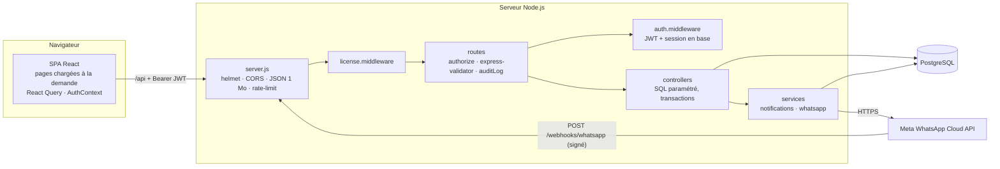
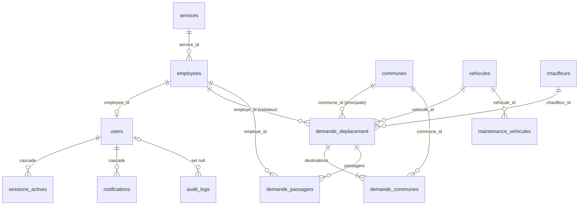

# SysLog — Documentation technique

Référence unique pour les développeurs, administrateurs système et mainteneurs de SysLog : architecture, installation, configuration, API, base de données, sécurité, audit, tests, déploiement, exploitation et feuille de route.

La documentation destinée aux utilisateurs est dans [`DOCUMENTATION_UTILISATEUR.md`](DOCUMENTATION_UTILISATEUR.md).

---

## Sommaire

1. [Vue d'ensemble](#1-vue-densemble)
2. [Architecture](#2-architecture)
3. [Stack technique](#3-stack-technique)
4. [Arborescence](#4-arborescence)
5. [Installation (développement)](#5-installation-développement)
6. [Variables d'environnement](#6-variables-denvironnement)
7. [Scripts](#7-scripts)
8. [Backend](#8-backend)
9. [Frontend](#9-frontend)
10. [Référence de l'API](#10-référence-de-lapi)
11. [Base de données](#11-base-de-données)
12. [Sécurité](#12-sécurité)
13. [Services externes : WhatsApp](#13-services-externes--whatsapp)
14. [Tests et intégration continue](#14-tests-et-intégration-continue)
15. [Déploiement en production](#15-déploiement-en-production)
16. [Exploitation et maintenance](#16-exploitation-et-maintenance)
17. [Dépannage](#17-dépannage)
18. [Audit de septembre 2026 et état des corrections](#18-audit-de-septembre-2026-et-état-des-corrections)
19. [Feuille de route](#19-feuille-de-route)

---

## 1. Vue d'ensemble

SysLog est une application web de **gestion logistique** : les employés saisissent des **demandes de sortie terrain** (une ou plusieurs communes) ; managers et administrateurs les **valident en affectant un véhicule et un chauffeur**, puis **clôturent la mission** avec le kilométrage. L'application gère aussi le **parc**, les **chauffeurs**, la **maintenance**, les **employés**, les **comptes et rôles**, les **jours fériés**, un **journal d'audit**, des **notifications** (internes et WhatsApp) et une **licence** d'utilisation.

| Aspect | Valeur |
|---|---|
| Type | SPA React + API REST Express + PostgreSQL |
| Rôles | `superadmin` (éditeur), `admin`, `manager`, `user` — chaque rôle hérite des droits du précédent |
| Langue | Interface, code métier et base en français |
| Mobile | Pas d'application mobile ; interface responsive |
| Dépôt | `https://github.com/sgnazere/syslog` (branche `main`) |

## 2. Architecture



Principes :

- **Couches** routes → middlewares → contrôleurs → SQL (`pg`, sans ORM). Les écritures multi-tables (demandes, validation, clôture, maintenance, comptes, licence) sont faites **en transaction** avec verrouillage des lignes (`SELECT … FOR UPDATE`).
- **Sessions côté serveur** : un JWT n'est accepté que si sa session existe dans `sessions_actives` et que le compte est actif ; le rôle est relu en base (cache de 30 s).
- **Notifications** envoyées **après** la validation de la transaction, sans bloquer la réponse.
- **Présentation** (regroupements, statistiques, exports Excel) calculée dans le navigateur.
- État serveur : pool PostgreSQL, cache mémoire de la licence (60 s) et des sessions (30 s). Pas de Redis, file ou worker.

## 3. Stack technique

| Couche | Technologies |
|---|---|
| Runtime | Node.js ≥ 18 (CI en Node 20) |
| Backend | Express 4, pg 8, jsonwebtoken 9, bcrypt 6 (natif), express-validator 7, express-rate-limit 7, helmet 7, cors, morgan, axios, marked + html-to-docx (export Word de la documentation), dotenv |
| Frontend | React 18, TypeScript 5 (`strict`), Vite 6, React Router 6, TanStack Query 5, Axios, Tailwind CSS 3, Recharts, react-hot-toast, SheetJS 0.20.3 (distribution officielle) |
| Base | PostgreSQL ≥ 14 (18 en développement) |
| Tests / CI | `node:test` (sans dépendance), GitHub Actions |

## 4. Arborescence

```
Syslog/
├── README.md
├── .github/workflows/ci.yml         intégration continue
├── docs/
│   ├── DOCUMENTATION_UTILISATEUR.md guide de formation par rôle (aussi exporté en .docx par l'API)
│   ├── images/                      captures d'écran du guide (données fictives)
│   └── DOCUMENTATION_TECHNIQUE.md   ce document
├── backend/
│   ├── .env.example                 variables de développement
│   ├── .env.production.example      variables de production
│   ├── migrations/                  SQL versionné, appliqué par scripts/migrate.js
│   ├── scripts/
│   │   ├── migrate.js               applique les migrations en attente
│   │   ├── create-admin.js          crée un administrateur (mot de passe provisoire)
│   │   └── set-role.js              change le rôle d'un compte existant
│   ├── test/                        tests unitaires, HTTP et d'intégration
│   └── src/
│       ├── server.js                point d'entrée
│       ├── config/                  env.js (validation), database.js (pool, transactions)
│       ├── middlewares/             auth, license, audit, validate
│       ├── routes/                  un fichier par ressource
│       ├── controllers/             logique métier + SQL
│       ├── services/                notifications.service.js, whatsapp.service.js
│       └── utils/                   licenseKey, redact, httpError
└── frontend/
    ├── index.html · vite.config.ts · tailwind.config.js · tsconfig*.json
    └── src/
        ├── main.tsx                 Router, QueryClient (erreurs globales), AuthProvider
        ├── App.tsx                  routes, gardes de rôle, chargement différé des pages
        ├── contexts/AuthContext.tsx session, déconnexion serveur, revalidation /auth/me
        ├── lib/                     api.ts, constants.ts, requestGroups.ts, xlsxExport.ts
        ├── hooks/                   un hook React Query par ressource
        ├── components/              AppLayout, ChangePasswordModal
        ├── pages/                   15 écrans
        └── types/index.ts
```

## 5. Installation (développement)

Prérequis : Node.js ≥ 18, npm, PostgreSQL ≥ 14, Git.

```bash
git clone https://github.com/sgnazere/syslog.git
cd syslog

# 1. Base de données et rôle applicatif
psql -U postgres -c "CREATE ROLE syslog_app LOGIN PASSWORD 'un-mot-de-passe-fort';"
psql -U postgres -c "CREATE DATABASE eclog OWNER syslog_app;"

# 2. Backend
cd backend
npm install
cp .env.example .env          # renseigner DB_*, JWT_SECRET, LICENSE_SECRET
npm run migrate               # crée le schéma et les données de référence
npm run create-admin -- admin@exemple.ci Nom Prénom   # affiche un mot de passe provisoire
npm run dev                   # http://localhost:5000 — vérifier GET /health

# 3. Frontend (autre terminal)
cd frontend
npm install
npm run dev                   # http://localhost:5173 (proxy /api → :5000)
```

4. Se connecter avec le compte créé, choisir un nouveau mot de passe, puis **Licence → Générer une licence** : sur une base sans licence, la première licence générée est active immédiatement.

> Générer un secret : `node -e "console.log(require('crypto').randomBytes(48).toString('hex'))"`

## 6. Variables d'environnement

Fichier `backend/.env`, chargé et validé par `src/config/env.js`. **En production (`NODE_ENV=production`), le serveur refuse de démarrer** si `JWT_SECRET`, `LICENSE_SECRET` ou `DB_PASSWORD` est absent, trop court ou égal à une valeur d'exemple ; hors production, un avertissement est affiché.

| Variable | Obligatoire | Défaut | Rôle |
|---|---|---|---|
| `DB_HOST` / `DB_PORT` / `DB_NAME` | non | `localhost` / `5432` / `eclog` | Connexion PostgreSQL |
| `DB_USER` | oui | — | Rôle applicatif — **jamais** le superutilisateur `postgres` |
| `DB_PASSWORD` | oui | — | 12 caractères minimum en production |
| `JWT_SECRET` | oui | — | Signature HS256 des jetons (≥ 32 caractères) |
| `JWT_EXPIRES_IN` | non | `8h` | Durée des sessions (toute syntaxe `jsonwebtoken` : `8h`, `30m`…) |
| `LICENSE_SECRET` | oui | — | Signature des clés de licence ; le changer invalide les clés existantes |
| `PORT` | non | `5000` | Port HTTP |
| `NODE_ENV` | oui en prod | — | `production` : validation stricte, erreurs 500 génériques, logs `combined` |
| `FRONTEND_URL` | recommandé | `http://localhost:5173` | Origine CORS autorisée |
| `TRUST_PROXY` | non | `1` en production, `0` sinon | Nombre de reverse proxys devant l'API (adresse IP réelle des clients) |
| `DB_POOL_MAX` | non | `30` | Connexions PostgreSQL simultanées de l'API (garder sous `max_connections` du serveur, 100 par défaut) |
| `UV_THREADPOOL_SIZE` | recommandé en production | `4` (Node) | Threads de calcul (hachage des mots de passe). **À définir dans l'environnement du processus avant son démarrage** (PM2, service) — sans effet dans `.env`. Valeur conseillée : nombre de cœurs du serveur |
| `WA_ENABLED` | non | `false` | Active l'envoi WhatsApp (`WA_TOKEN` et `WA_PHONE_ID` deviennent obligatoires) |
| `WA_PHONE_ID` / `WA_TOKEN` | si WhatsApp | — | Identifiant du numéro et jeton d'accès Meta |
| `WA_VERIFY_TOKEN` | si webhook | — | Jeton de vérification du webhook |
| `WA_APP_SECRET` | si webhook | — | App Secret Meta : vérification de la signature `X-Hub-Signature-256` (sans lui, les événements entrants sont refusés) |

Le frontend n'a aucune variable : il appelle l'API en relatif (`/api`) ; en développement le proxy Vite redirige vers `localhost:5000`.

## 7. Scripts

| Emplacement | Commande | Effet |
|---|---|---|
| backend | `npm run dev` / `npm start` | Démarrage (nodemon / node) |
| backend | `npm run migrate` | Applique les migrations en attente, chacune dans une transaction, tracées dans `schema_migrations` |
| backend | `npm run migrate -- --status` | Liste les migrations appliquées (✓) et en attente (·) |
| backend | `npm run create-admin -- <email> <Nom> <Prénom> [--superadmin]` | Crée un administrateur (ou super-administrateur) avec un mot de passe provisoire aléatoire, affiché une fois, à changer à la première connexion |
| backend | `npm run reset-password -- <email>` | Réinitialise le mot de passe d'un compte (mot de passe provisoire affiché une fois, changement imposé, sessions fermées) |
| backend | `npm run set-role -- <email> <superadmin\|admin\|manager\|user>` | Change le rôle d'un compte existant et ferme ses sessions (ex. désigner le premier super-administrateur) |
| backend | `npm test` | Tests unitaires et HTTP (sans base) |
| backend | `INTEGRATION=1 npm test` | + scénario d'intégration complet sur la base configurée (données de test supprimées à la fin) |
| frontend | `npm run dev` | Serveur de développement Vite |
| frontend | `npm run typecheck` | Vérification TypeScript |
| frontend | `npm run build` | Type-check + build de production dans `frontend/dist/` |
| frontend | `npm run preview` | Sert le build localement |

## 8. Backend

### 8.1 Chaîne de traitement (`server.js`)

`helmet` → CORS → `express.json` (1 Mo, corps brut conservé pour les signatures) → logs `morgan` → limite de débit `/api` (300 req / 15 min / IP) → limite de connexion (10 essais / 15 min par couple IP + e-mail) → `/webhooks` (public) → contrôle de licence sur `/api` → routes → 404 → gestionnaire d'erreurs.

Le gestionnaire d'erreurs renvoie :

- le message des erreurs métier (`HttpError`) ;
- une traduction des erreurs PostgreSQL connues : règle levée par un trigger → 409, unicité → 409, clé étrangère → 409, champ manquant/hors limites → 422, format invalide → 422 ;
- sinon 500 (« Erreur serveur interne. » en production, message réel en développement).

### 8.2 Middlewares

| Fichier | Rôle |
|---|---|
| `license.middleware.js` | Bloque `/api/*` sans licence valide (`403 NO_LICENSE / LICENSE_EXPIRED / LICENSE_SUSPENDED`). Exemptés : `/api/auth/*` et `/api/license/*`, pour qu'un administrateur puisse toujours se connecter et renouveler. En cas d'erreur de base : 503 |
| `auth.middleware.js` | `authenticate` : vérifie le JWT (HS256), puis la session en base et `is_active` ; renseigne `req.user` (`id, email, role, nom, prenom, name, employee_id, must_change_password`). Si `must_change_password`, seules `/api/auth/me`, `/change-password` et `/logout` sont autorisées (`403 PASSWORD_CHANGE_REQUIRED`). `authorize(...rôles)` : 403 sinon ; un `superadmin` satisfait toute exigence `admin` (`hasRole`) |
| `validate.middleware.js` | `validate` (erreurs `express-validator` → 422 avec `details`) ; `passwordRule` (10 caractères, une lettre, un chiffre) |
| `audit.middleware.js` | Après une réponse 2xx, insère l'action dans `audit_logs` avec `body` **masqué** (`utils/redact.js` : mots de passe, clés, jetons, secrets, n° de sécurité sociale) et `params` |

### 8.3 Règles métier

| Règle | Où |
|---|---|
| Une demande peut viser plusieurs communes (`demande_communes`) ; `commune_id` = destination principale | `requests.controller.create` |
| Un `user` crée ses demandes pour lui-même (`employe_id` forcé à sa fiche) ; un compte sans fiche ne peut pas créer de demande | `requests.controller.create` |
| Une seule demande non refusée par employé et par date | Trigger `check_employee_duplicate_requests` → 409 |
| Initiateur et passagers : employés **actifs** ; retour après le départ | `requests.controller.create` |
| Un `user` ne voit que les demandes dont il est initiateur ou passager (liste et détail) | `visibilityClause` |
| Transitions : `en_attente → validee → terminee` ; `en_attente | validee → refusee` ; tout autre changement → 409 | `requests.controller` |
| Validation : véhicule et chauffeur `disponible` (verrouillés), capacité ≥ personnes, permis valide à la date de mission | `requests.controller.validate` |
| Refus : motif obligatoire, conservé (`motif_refus`) ; libère véhicule et chauffeur si la demande était validée | `requests.controller.reject` |
| Clôture : `km_retour ≥ km_depart` et ≥ compteur actuel ; compteur mis à jour ; véhicule et chauffeur libérés | `requests.controller.complete` |
| Maintenance : impossible sur un véhicule en mission ; véhicule `en_maintenance` à la création ; libéré (ou hors service) à la clôture ou à la suppression du dernier dossier ouvert ; dossier `en_cours` non supprimable | `maintenance.controller` |
| Licence : nombre maximal d'**utilisateurs actifs** (hors super-administrateurs) contrôlé à la création, à la réactivation et au changement de rôle d'un compte ; nombre maximal de **personnes connectées** contrôlé à la connexion (les administrateurs ne sont jamais bloqués) | `users.controller.assertUserQuota`, `auth.controller.login` |
| Comptes : pas d'auto-désactivation ni d'auto-rétrogradation, toujours ≥ 1 admin (ou superadmin) actif et ≥ 1 superadmin actif ; désactivation, réinitialisation et changement de rôle ferment les sessions | `users.controller` |
| Seul un `superadmin` attribue ce rôle ou agit sur un compte `superadmin` (création, modification, désactivation, réinitialisation) | `users.controller.assertCanManage` |
| Émission (`/generate`) et suspension/réactivation (`/:id/status`) des licences réservées au `superadmin` ; l'administrateur consulte, active une clé et gère les sessions | `license.routes` |
| Suppression d'un employé, véhicule ou chauffeur ayant un historique → 409 avec conseil de désactivation | contrôleurs |

### 8.4 Notifications

`services/notifications.service.js` crée les notifications internes ; `requests.controller` les déclenche après chaque transaction :

| Événement | Destinataires (comptes actifs liés via `users.employee_id`) | WhatsApp |
|---|---|---|
| Création | managers et admins (sauf l'auteur) | — |
| Validation | initiateur + passagers | `sortie_validee` (initiateur, passagers), `mission_chauffeur` (chauffeur) |
| Refus | initiateur + passagers | `sortie_refusee` |
| Clôture | initiateur + passagers | `mission_cloturee` |

## 9. Frontend

### 9.1 Routage et accès

| Chemin | Rôles |
|---|---|
| `/login` | public |
| `/`, `/requests`, `/calendar`, `/notifications` | tous |
| `/employees` (consultation pour les managers), `/vehicles`, `/drivers`, `/maintenance`, `/reports` | admin, manager |
| `/users`, `/holidays`, `/audit`, `/license`, `/whatsapp` | admin (et superadmin) ; onglet « Générer une licence » et boutons Suspendre/Réactiver : superadmin |

Les gardes de `App.tsx` sont une commodité d'interface : **la sécurité est appliquée par l'API**. Les pages sont chargées à la demande (`React.lazy`) : bundle initial ≈ 306 ko (100 ko gzip).

### 9.2 Session

- `AuthContext` : jeton et utilisateur en `localStorage` (`sl_token`, `sl_user`), revalidés au chargement par `GET /api/auth/me` ; `logout()` appelle `POST /api/auth/logout`.
- `lib/api.ts` : Axios `baseURL: '/api'`, jeton ajouté automatiquement ; toute 401 (hors tentative de connexion) purge la session et renvoie à `/login` ; `downloadFile()` pour les téléchargements authentifiés.
- `must_change_password` : `AppLayout` n'affiche que `ChangePasswordModal` (mode forcé) tant que le mot de passe n'est pas changé.

### 9.3 Données

- Un hook React Query par ressource (`hooks/`), invalidations après mutation. `main.tsx` affiche l'erreur serveur de toute mutation sans gestion propre (`MutationCache.onError`).
- `lib/requestGroups.ts` : helpers de dates (`normISO`, `todayISO`), regroupement des demandes pour l'affichage (compatibilité avec les anciennes demandes multi-lignes), `perDestination` (une entrée par commune) et `communesLabel`, partagés par les pages Demandes, Tableau de bord, Calendrier et Rapports.
- Les dates SQL `DATE` arrivent au format `AAAA-MM-JJ` (pas de conversion de fuseau).
- Exports Excel : `lib/xlsxExport.ts`, générés dans le navigateur.

## 10. Référence de l'API

### 10.1 Conventions

| Élément | Valeur |
|---|---|
| Base | `/api` (JSON), sauf `/health` et `/webhooks` |
| Authentification | `Authorization: Bearer <JWT>` (obtenu par `POST /api/auth/login`) |
| Succès | `{ "data": …, "message"?: string, "total"?: number }` |
| Erreur | `{ "error": string, "details"?: [{ "field", "message" }], "code"?: string }` |
| Codes | 200, 201 · 400 règle · 401 non authentifié / session révoquée · 403 rôle, licence, mot de passe à changer, limite de connexions · 404 · 409 conflit / état incompatible · 413 · 422 validation · 429 · 500 · 502 (échec WhatsApp) · 503 |
| Pagination | `/api/audit` (`page`, `limit ≤ 100`) et `/api/notifications` (50 dernières) ; les autres listes sont complètes |

### 10.2 Endpoints (59)

| Méthode | Endpoint | Rôle | Description |
|---|---|---|---|
| GET | `/health` | public | `{ status, database }` — 503 si la base est indisponible |
| POST | `/api/auth/login` | public | `{ email, password }` → `{ token, user }` ; 401, 403 `MAX_CONNECTIONS_REACHED` (jamais pour un admin), 429 |
| POST | `/api/auth/logout` | connecté | Ferme la session courante |
| GET | `/api/auth/me` | connecté | Profil courant (dont `employee_id`, `must_change_password`) |
| PUT | `/api/auth/change-password` | connecté | `{ currentPassword, newPassword }` ; ferme les autres sessions |
| GET | `/api/license` | admin | Licence courante (clé masquée) + `stats` |
| POST | `/api/license/generate` | superadmin | `{ organisation, date_expiration, contact?, max_utilisateurs? = 500, max_connexions? = 500, modules?, notes? }` → clé complète (unique affichage) ; active seulement si aucune autre ne l'est |
| POST | `/api/license/activate` | admin | `{ cle }` : vérifie la signature, suspend l'ancienne, active la nouvelle (transaction) |
| PATCH | `/api/license/:id/status` | superadmin | `{ statut: active \| suspendue }` |
| GET | `/api/license/sessions` | admin | Sessions actives |
| DELETE | `/api/license/sessions/:id` | admin | Ferme la session (jeton aussitôt refusé) |
| GET | `/api/users/employees` | connecté | Employés actifs pour les listes : `{ id, nom, prenoms, poste, projet, service_nom, has_account, name }` (ni téléphone ni e-mail) |
| GET | `/api/users` | admin | Comptes (`role`, `active`, `search`) |
| GET | `/api/users/:id` | admin | Un compte |
| POST | `/api/users` | admin | Rôle `superadmin` attribuable par un superadmin uniquement. `{ role, password, employee_id?, nom?, prenom?, email? }` — les champs d'identité sont repris de la fiche employé si fournie ; `must_change_password = true` |
| PUT | `/api/users/:id` | admin | `{ role, employee_id?, nom?, prenom?, email?, is_active? }` |
| PATCH | `/api/users/:id/toggle-active` | admin | Active / désactive (ferme les sessions) |
| PUT | `/api/users/:id/reset-password` | admin | `{ newPassword }` — ferme les sessions, impose un changement |
| GET | `/api/employees` | admin, manager | Fiches complètes (`statut`, `service_id`, `search`) |
| GET | `/api/employees/:id` | admin | Une fiche |
| POST / PUT | `/api/employees[/:id]` | admin | `{ nom, prenoms, email?, date_naissance?, poste?, projet?, service_id?, date_embauche?, telephone?, numero_secu?, numero_urgence?, type_contrat?, status? }` |
| DELETE | `/api/employees/:id` | admin | 409 si l'employé figure dans des demandes |
| GET | `/api/vehicles[/:id]` | connecté | Véhicules (`statut`, `type_vehicule`) |
| POST / PUT | `/api/vehicles[/:id]` | admin, manager | `{ immatriculation, marque, modele, type_vehicule, capacite, kilometrage?, annee_mise_service?, energie?, statut? }` ; 409 immatriculation existante |
| DELETE | `/api/vehicles/:id` | admin | 409 si historique |
| GET | `/api/drivers` | connecté | Chauffeurs (`statut`) |
| POST / PUT | `/api/drivers[/:id]` | admin, manager | `{ nom, prenoms, numero_permis, type_permis, date_expiration_permis, telephone?, email?, statut? }` |
| DELETE | `/api/drivers/:id` | admin | 409 si historique |
| GET | `/api/requests` | connecté | Demandes (`statut`, `commune_id`, `from`, `to`, `employe_id`) avec `communes[]`, `passagers[]`, `motif_refus` ; filtrées pour `user` |
| GET | `/api/requests/:id` | connecté | 404 si hors du périmètre d'un `user` |
| POST | `/api/requests` | connecté | `{ employe_id, commune_ids[], date_deplacement, heure_depart, heure_retour, objectif, passager_ids? }` (`commune_id` seul accepté) → `{ data: { id, total_personnes }, groupingSuggestions, vehiculeSuggestion }` |
| PATCH | `/api/requests/:id/validate` | admin, manager | `{ vehicule_id?, chauffeur_id? }` |
| PATCH | `/api/requests/:id/reject` | admin, manager | `{ reason }` |
| PATCH | `/api/requests/:id/complete` | admin, manager | `{ km_depart?, km_retour? }` → `{ data, distance }` |
| GET | `/api/maintenance` | admin, manager | Dossiers (`vehicule_id`, `statut`) |
| POST | `/api/maintenance` | admin, manager | `{ vehicule_id, type_maintenance, date_debut, date_fin?, cout?, description?, statut? (planifiee \| en_cours) }` |
| PUT | `/api/maintenance/:id` | admin, manager | Modifie un dossier ouvert |
| PATCH | `/api/maintenance/:id/close` | admin, manager | `{ cout?, description?, next_statut? (disponible \| hors_service) }` |
| DELETE | `/api/maintenance/:id` | admin | 409 si `en_cours` |
| GET | `/api/communes`, `/api/communes/districts`, `/api/communes/services` | connecté | Référentiels `{ id, nom }` |
| GET | `/api/notifications` | connecté | 50 dernières notifications de l'utilisateur |
| PATCH | `/api/notifications/read-all` | connecté | Tout marquer lu |
| PATCH | `/api/notifications/:id/read` | connecté | Marquer lu |
| GET | `/api/holidays` | connecté | Jours fériés |
| POST | `/api/holidays` | admin | `{ name, date, recurring? }` ; 409 si la date existe |
| DELETE | `/api/holidays/:id` | admin | — |
| GET | `/api/audit` | admin | Journal paginé (`userId`, `entity`, `action`, `from`, `to`, `page`, `limit`) |
| GET | `/api/audit/meta` | admin | Valeurs des filtres |
| GET | `/api/docs/manual` | admin, manager | `docs/DOCUMENTATION_UTILISATEUR.md` converti en .docx |
| GET | `/api/whatsapp/status` | admin | État de la configuration (sans secret) |
| POST | `/api/whatsapp/test` | admin | `{ phone, message }` ; 400 numéro invalide, 502 échec Meta |
| GET | `/webhooks/whatsapp` | public (Meta) | Vérification (`hub.verify_token`) |
| POST | `/webhooks/whatsapp` | public (Meta) | Événements ; signature `X-Hub-Signature-256` obligatoire (401 sinon) |

Actions journalisées dans `audit_logs` : `CREATE_USER`, `UPDATE_USER`, `TOGGLE_ACTIVE`, `RESET_PASSWORD`, `CHANGE_PASSWORD`, `CREATE_EMPLOYEE`, `UPDATE_EMPLOYEE`, `DELETE_EMPLOYEE`, `CREATE_VEHICLE`, `UPDATE_VEHICLE`, `DELETE_VEHICLE`, `CREATE_DRIVER`, `UPDATE_DRIVER`, `DELETE_DRIVER`, `CREATE_REQUEST`, `VALIDATE_REQUEST`, `REJECT_REQUEST`, `COMPLETE_MISSION`, `CREATE`/`UPDATE`/`CLOSE`/`DELETE` (maintenance), `CREATE_HOLIDAY`, `DELETE_HOLIDAY`, `GENERATE_LICENSE`, `ACTIVATE_LICENSE`, `CHANGE_LICENSE_STATUS`, `KILL_SESSION`.

## 11. Base de données

### 11.1 Migrations

Le schéma est entièrement versionné dans `backend/migrations/` et appliqué par `npm run migrate` (table de suivi `schema_migrations`). Une migration appliquée ne doit **jamais** être modifiée : toute évolution passe par un nouveau fichier numéroté.

| Fichier | Contenu |
|---|---|
| `001_schema_initial.sql` | Types énumérés, tables, index, fonctions et triggers (idempotent : applicable sur une base existante conforme) |
| `002_corrections_audit.sql` | `demande_communes`, `notifications`, `holidays`, `users.employee_id` (+ rattachement par e-mail), `users.must_change_password`, historique d'audit conservé (`ON DELETE SET NULL`), purge des mots de passe en clair de l'audit, suppression du trigger de capacité inopérant, index |
| `003_donnees_reference.sql` | Communes, districts, services (insère les valeurs absentes) |
| `004_motif_refus.sql` | `demande_deplacement.motif_refus` |
| `005_role_superadmin.sql` | Valeur `superadmin` du type `user_role` |

### 11.2 Modèle



| Table | Points clés |
|---|---|
| `users` | `email` unique, `password` (bcrypt), `role` (`user_role` : superadmin, admin, manager, user), `is_active`, `employee_id` (unique, FK), `must_change_password` |
| `employees` | Données personnelles : `telephone`, `numero_secu`, `date_naissance`, `numero_urgence` ; `status` actif/inactif |
| `vehicules` | `immatriculation` unique, `capacite`, `kilometrage`, `statut` (disponible, en_mission, en_maintenance, hors_service) |
| `chauffeurs` | `date_expiration_permis`, `statut` (disponible, en_mission, indisponible) |
| `demande_deplacement` | `statut` (en_attente, validee, refusee, terminee), horaires, `km_*`, `motif_refus`, contrainte `chk_km_coherence` |
| `demande_communes` | Destinations ordonnées d'une demande |
| `demande_passagers` | Passagers d'une demande |
| `maintenance_vehicules` | `statut` (planifiee, en_cours, terminee), `cout` |
| `notifications` | `title`, `message`, `type`, `read`, `request_id` |
| `holidays` | `date` unique, `recurring` |
| `audit_logs` | `action`, `entity`, `entity_id`, `details` (masqués), `ip_address` |
| `licences` | `cle` unique, limites, `statut` (une seule `active`, index unique partiel) |
| `sessions_actives` | `token_hash` (SHA-256 du JWT), `expires_at`, `last_seen` |
| `communes`, `districts`, `services` | Référentiels |

Triggers : `check_employee_duplicate_requests` (une demande non refusée par employé et par date), mise à jour automatique des dates de modification.

> La base de développement historique (`eclog`) contient aussi des tables d'applications antérieures (`admin`, `auth_*`, `licenses`, `demandes_vehicules`, `sorties_*`, `deplacements`, `projets`…) **non utilisées** par SysLog. En production, SysLog doit disposer de sa propre base créée par les migrations.

## 12. Sécurité

### 12.1 Mesures en place

| Domaine | Mesure |
|---|---|
| Mots de passe | bcrypt natif coût 12, calculé hors du fil principal avec un nombre de calculs simultanés limité ; 10 caractères minimum avec lettre et chiffre ; changement imposé après création ou réinitialisation par un admin ; temps de réponse homogène pour un e-mail inconnu |
| Sessions | JWT HS256 + session en base obligatoire : révocation immédiate à la déconnexion, désactivation, réinitialisation, changement de rôle ou de mot de passe ; 3 sessions max par utilisateur |
| Autorisations | Rôle vérifié sur chaque route ; contrôle par objet sur les demandes ; données RH réservées aux admins/managers ; listes de sélection sans données personnelles |
| Entrées | `express-validator` sur toutes les écritures ; requêtes SQL paramétrées ; corps JSON limité à 1 Mo |
| Journalisation | Audit des actions sensibles avec masquage des secrets ; numéros de téléphone masqués dans les logs WhatsApp |
| Transport / HTTP | `helmet`, CORS mono-origine, HTTPS via Nginx + Let's Encrypt en production |
| Abus | 300 requêtes / 15 min / IP ; 10 tentatives de connexion / 15 min par IP et e-mail ; `trust proxy` pour l'IP réelle |
| Secrets | Aucun secret dans le code ; validation au démarrage ; `.env` ignoré par Git |
| Webhook | Jeton de vérification + signature HMAC Meta obligatoire |
| Dépendances | `npm audit` en CI ; SheetJS depuis sa distribution officielle corrigée |

### 12.2 Consignes de développement

- Toute nouvelle route d'écriture : règles `express-validator` + `validate`, `authorize(...)`, `auditLog(...)` si l'action est sensible.
- Toute lecture unitaire d'un objet appartenant à un utilisateur : vérifier l'appartenance, pas seulement le rôle.
- Toute écriture sur plusieurs tables : `withTransaction` et verrouillage des lignes concernées.
- Ne jamais concaténer une entrée utilisateur dans du SQL.
- Tout nouveau champ sensible : l'ajouter à `utils/redact.js`.
- Le middleware de licence voit les chemins **sans** préfixe de montage : utiliser `req.baseUrl + req.path`.

### 12.3 Risques résiduels

Voir [§18.3](#183-points-restant-ouverts).

## 13. Services externes : WhatsApp

- API Meta **WhatsApp Cloud v18.0**, modèles à faire approuver dans Meta Business Manager : `sortie_validee`, `mission_chauffeur`, `sortie_refusee`, `mission_cloturee` (le corps attendu de chaque modèle est affiché dans l'écran WhatsApp de l'application).
- Numéros : format ivoirien à 10 chiffres, normalisés en `225XXXXXXXXXX` (`normalizePhone`).
- Timeout 8 s, pas de nouvel essai ; un échec est journalisé et n'affecte jamais l'opération métier. Les messages modèles sont facturés par Meta selon sa grille en vigueur.
- Webhook : `https://<domaine>/webhooks/whatsapp`, jeton `WA_VERIFY_TOKEN`, signature vérifiée avec `WA_APP_SECRET`. Les statuts de livraison et messages entrants sont seulement journalisés.

## 14. Tests et intégration continue

| Fichier | Couverture |
|---|---|
| `test/unit.test.js` | Héritage des rôles (`hasRole`), masquage des secrets, normalisation des téléphones, formatage des dates, exemptions de licence, signature des clés, traduction des erreurs PostgreSQL |
| `test/http.test.js` | Authentification sans licence, jetons invalides, validation, JSON invalide, webhook (jeton et signature), 404 |
| `test/integration.test.js` (`INTEGRATION=1`) | Scénario complet sur base réelle : droits réservés au superadmin, changement de mot de passe imposé, politique de mot de passe, audit sans secret, demande multi-destinations, doublon de date, permis expiré, validations concurrentes, clôture et compteur, machine à états, notifications, périmètre d'un `user`, révocation par désactivation et déconnexion |

### Test de charge (28/09/2026)

Réalisé sur une base dédiée de 500 comptes, 500 employés et 2 000 demandes, chaque utilisateur simulé ayant sa propre adresse IP, API seule (sans Nginx) sur un poste Windows 12 cœurs avec `UV_THREADPOOL_SIZE=12`, requêtes limitées à 100 connexions simultanées vers l'API (rôle joué par Nginx en production).

| Scénario | Résultat |
|---|---|
| Licence limitée à 450 personnes connectées, 500 connexions simultanées | 450 acceptées, 50 refusées (message explicite), administrateur toujours accepté |
| Licence à 500 : 500 connexions dans la même seconde | 500/500 en 13,7 s (médiane 2,6 s par personne) |
| 500 personnes connectées travaillant en même temps (1 500 requêtes) | 1 500/1 500 en 2,9 s — médiane 110 ms, p95 608 ms |
| 500 demandes de sortie créées en même temps | 500/500 en 1,7 s — médiane 316 ms |
| Création du 501e compte actif | Refusée (403 « Limite de la licence atteinte ») |
| 500 déconnexions simultanées | 500/500, aucune session restante |
| Erreurs serveur | 0 |

Corrections issues de ce test : remplacement de `bcryptjs` (JavaScript pur, qui bloquait le serveur : 457 échecs sur 500 connexions simultanées) par `bcrypt` natif ; limitation des hachages simultanés pour que l'ouverture des connexions PostgreSQL ne soit jamais bloquée ; pool porté à 30 connexions ; file d'attente TCP portée à 2 048. Le temps de connexion d'un pic de 500 personnes dépend surtout du nombre de cœurs (`UV_THREADPOOL_SIZE`) : environ 4 fois plus long avec la valeur par défaut de 4 threads.

La CI (`.github/workflows/ci.yml`), à chaque push sur `main` et chaque pull request :

- **backend** : PostgreSQL 16 éphémère, `npm ci`, `npm run migrate` sur base vide, tests unitaires + intégration, `npm audit --omit=dev --audit-level=critical` ;
- **frontend** : `npm ci`, `npm run typecheck`, `npm run build`.

## 15. Déploiement en production

Cible recommandée : VPS Ubuntu 22.04+ (2 vCPU, 2 Go RAM, 20 Go SSD), Node.js 20, PostgreSQL, Nginx, PM2.

### 15.1 Base de données

```bash
sudo -u postgres psql <<'SQL'
CREATE ROLE syslog_app LOGIN PASSWORD '<mot de passe fort, 20+ caractères>';
CREATE DATABASE syslog_prod OWNER syslog_app;
SQL
```

Le rôle applicatif ne doit pas être superutilisateur. Pour aller plus loin, utiliser un rôle propriétaire pour les migrations et un rôle limité à `SELECT/INSERT/UPDATE/DELETE` pour l'application.

### 15.2 Application

```bash
git clone https://github.com/sgnazere/syslog.git /var/www/syslog
cd /var/www/syslog/backend
npm ci --omit=dev
cp .env.production.example .env        # renseigner toutes les valeurs (secrets NEUFS)
npm run migrate
npm run create-admin -- admin@espaceconfiance.ci Nom Prénom

cd ../frontend
npm ci && npm run build                 # produit frontend/dist/
```

### 15.3 PM2

```bash
sudo npm install -g pm2
cd /var/www/syslog/backend
UV_THREADPOOL_SIZE=$(nproc) pm2 start src/server.js --name syslog-api --update-env
pm2 startup && pm2 save
pm2 logs syslog-api
```

### 15.4 Nginx

```nginx
# /etc/nginx/sites-available/syslog
server {
    listen 80;
    server_name syslog.espaceconfiance.ci;

    root /var/www/syslog/frontend/dist;
    index index.html;

    # En-têtes de sécurité du frontend
    add_header X-Content-Type-Options nosniff always;
    add_header X-Frame-Options DENY always;
    add_header Referrer-Policy strict-origin-when-cross-origin always;
    add_header Content-Security-Policy "default-src 'self'; img-src 'self' data:; style-src 'self' 'unsafe-inline'; connect-src 'self'; frame-ancestors 'none'" always;

    # Application monopage
    location / {
        try_files $uri $uri/ /index.html;
    }

    # API et webhook vers Node.js
    location ~ ^/(api|webhooks|health) {
        proxy_pass         http://127.0.0.1:5000;
        proxy_http_version 1.1;
        proxy_set_header   Host              $host;
        proxy_set_header   X-Real-IP         $remote_addr;
        proxy_set_header   X-Forwarded-For   $proxy_add_x_forwarded_for;
        proxy_set_header   X-Forwarded-Proto $scheme;
    }
}
```

```bash
sudo ln -s /etc/nginx/sites-available/syslog /etc/nginx/sites-enabled/
sudo nginx -t && sudo systemctl reload nginx
sudo apt install certbot python3-certbot-nginx
sudo certbot --nginx -d syslog.espaceconfiance.ci      # HTTPS + redirection automatique
```

Avec Nginx devant l'API, laisser `TRUST_PROXY=1` : la limite de connexion et les journaux utilisent alors l'adresse réelle des clients.

### 15.5 Licence, pare-feu, sauvegardes

- Se connecter avec l'administrateur créé, changer le mot de passe, puis **Licence → Générer une licence** (le `LICENSE_SECRET` de production rend les clés de développement invalides).
- Pare-feu : `ufw allow 22,80,443/tcp` ; ports 5000 et 5432 fermés depuis l'extérieur.
- Sauvegardes (crontab de l'utilisateur système) :

```bash
0 2 * * * pg_dump -Fc -U syslog_app syslog_prod > /backups/syslog/syslog_$(date +\%Y\%m\%d).dump
0 3 * * * find /backups/syslog -name "*.dump" -mtime +30 -delete
```

Tester régulièrement la restauration : `pg_restore -d <base_de_test> <fichier.dump>`.

### 15.6 Mise à jour

```bash
cd /var/www/syslog && git pull
cd backend && npm ci --omit=dev && npm run migrate && pm2 restart syslog-api
cd ../frontend && npm ci && npm run build
```

### 15.7 Checklist de mise en ligne

```
[ ] .env de production avec secrets neufs, NODE_ENV=production, TRUST_PROXY=1
[ ] Rôle PostgreSQL dédié (non superutilisateur) et base syslog_prod
[ ] npm run migrate exécuté sans erreur
[ ] Administrateur créé, mot de passe changé
[ ] Frontend construit (npm run build)
[ ] PM2 actif et configuré au démarrage
[ ] Nginx + HTTPS (Let's Encrypt) + en-têtes de sécurité
[ ] Licence de production générée et active
[ ] Pare-feu : 5000 et 5432 fermés
[ ] Sauvegarde quotidienne et restauration testée
[ ] GET /health → {"status":"ok","database":"ok"}
[ ] Parcours complet : demande → validation → clôture
```

## 16. Exploitation et maintenance

| Tâche | Procédure |
|---|---|
| Créer un administrateur | `npm run create-admin -- <email> <Nom> <Prénom>` (ajouter `--superadmin` pour l'éditeur) |
| Changer le rôle d'un compte | `npm run set-role -- <email> <rôle>` ou écran Accès & Rôles |
| Mettre à jour les captures du guide | Les captures de `docs/images/` proviennent d'une base de démonstration **fictive** : ne jamais y faire figurer de données réelles |
| Modifier les limites de la licence | Super-administrateur : générer une nouvelle licence (500 utilisateurs et 500 connexions par défaut) puis l'activer |
| Mot de passe perdu (y compris pour tous les admins) | Sur le serveur : `npm run reset-password -- <email>` affiche un mot de passe provisoire (à changer à la connexion) |
| Instance bloquée par la licence | Se connecter en admin (toujours possible) → Licence → activer ou générer une clé |
| Fermer toutes les sessions d'un utilisateur | Désactiver puis réactiver le compte, ou `DELETE FROM sessions_actives WHERE user_id = <id>;` |
| Purges périodiques (recommandées) | `DELETE FROM sessions_actives WHERE expires_at < NOW();` · notifications lues de plus de 6 mois · journal d'audit selon la politique de conservation de l'organisation |
| État des migrations | `npm run migrate -- --status` |
| Surveillance | Sonde HTTP sur `/health` (503 si la base est indisponible) ; `pm2 logs syslog-api` |
| Dépendances | `npm audit` / `npm outdated`, mise à jour, `npm test` et `INTEGRATION=1 npm test` sur une base de test |

## 17. Dépannage

| Symptôme | Cause probable | Action |
|---|---|---|
| Le serveur refuse de démarrer : « Configuration invalide » | Secret absent, trop court ou d'exemple en production | Compléter `.env` |
| `PostgreSQL connexion échouée` | Variables `DB_*`, service arrêté, pare-feu | Vérifier `.env` et `systemctl status postgresql` |
| Erreurs « relation … n'existe pas » | Migrations non appliquées | `npm run migrate` |
| « Système non licencié » pour tous | Aucune licence active | Admin → Licence |
| « Trop de tentatives de connexion » pour tout le monde | `TRUST_PROXY` absent derrière Nginx | `TRUST_PROXY=1`, en-têtes `X-Forwarded-For` |
| Un utilisateur ne voit pas ses demandes / ne peut pas en créer | Compte non rattaché à sa fiche employé | Écran Comptes → lier l'employé |
| Aucun message WhatsApp | `WA_ENABLED`, jeton, modèles non approuvés, téléphone absent ou mal formé | Écran WhatsApp (statut, test) ; journaux `[WhatsApp ERROR]` |
| Webhook Meta refusé (401) | `WA_APP_SECRET` absent ou erroné | Renseigner l'App Secret de l'application Meta |
| Le téléchargement de la documentation échoue | Fichier `docs/DOCUMENTATION_UTILISATEUR.md` absent sur le serveur | Déployer le dossier `docs/` avec le code |
| `npm run build` échoue | Erreur TypeScript | `npm run typecheck` pour le détail |

## 18. Audit de septembre 2026 et état des corrections

### 18.1 Contexte

Un audit complet (sécurité, architecture, code, données, tests, documentation) a été réalisé le 28/09/2026 sur le commit `4b21173`, suivi des corrections décrites ci-dessous. Maturité globale constatée avant corrections : **niveau 2 — MVP fonctionnel** (sécurité et données au niveau 1, tests au niveau 0). Constats principaux : mots de passe en clair dans le journal d'audit, injection SQL latente, contrôles d'accès insuffisants (IDOR, données RH exposées), verrouillage total possible par la licence, jetons non révocables, schéma de base non versionné, build frontend en échec, fonctions annoncées non opérationnelles (multi-destinations, notifications, jours fériés, WhatsApp).

### 18.2 Findings et statut

**Sécurité**

| ID | Finding (sévérité initiale) | Statut | Correction |
|---|---|---|---|
| SEC-01 | Mots de passe en clair dans `audit_logs` (critique) | ✅ Corrigé | Masquage récursif (`redact`) ; purge des données existantes (migration 002) |
| SEC-02 | Injection SQL `GET /api/reports/summary` (élevé) | ✅ Corrigé | Endpoint (inutilisé, sur tables inexistantes) supprimé |
| SEC-03 | IDOR `GET /api/requests/:id` (élevé) | ✅ Corrigé | Même périmètre que la liste ; 404 hors périmètre |
| SEC-04 | Filtre `user` en échec ouvert (élevé) | ✅ Corrigé | Lien explicite `users.employee_id` ; sans fiche : aucune demande |
| SEC-05 | Données RH lisibles par tous (élevé) | ✅ Corrigé | `GET /employees` réservé admin/manager ; liste de sélection minimale |
| SEC-06 | Aucune révocation de JWT (élevé) | ✅ Corrigé | Session en base obligatoire, révocations immédiates |
| SEC-07 | Secrets faibles, superutilisateur, replis codés en dur (élevé) | ◐ Partiel | Validation au démarrage, replis supprimés, `JWT_SECRET` local régénéré. **Reste** : la base de développement locale utilise toujours le superutilisateur `postgres` (voir 18.3) |
| SEC-08 | Demandes au nom d'autrui (moyen) | ✅ Corrigé | `employe_id` forcé pour un `user` ; initiateur/passagers actifs |
| SEC-09 | Exemptions du middleware licence inopérantes (élevé) | ✅ Corrigé | Chemin complet ; auth et licence toujours accessibles ; testé |
| SEC-10 | Licence auto-générée par tout admin (moyen) | ◐ Partiel | Émission et suspension réservées au rôle `superadmin` (éditeur) ; échec « fermé » (503). **Reste** : le secret de signature réside sur le serveur du client — signature asymétrique à prévoir (R-01) |
| SEC-11 | Limite de sessions exploitable (moyen) | ✅ Corrigé | Sessions libérées à la déconnexion, 3 par utilisateur, décompte par utilisateur, admins jamais bloqués |
| SEC-12 | Rate limiting derrière proxy (moyen) | ✅ Corrigé | `TRUST_PROXY` ; clé IP + e-mail pour la connexion |
| SEC-13 | Politique de mot de passe faible (moyen) | ✅ Corrigé | 10 caractères, lettre + chiffre ; écran de changement ; changement imposé |
| SEC-14 | JWT en `localStorage` (moyen) | ○ Ouvert | Atténué par la révocation serveur et la CSP Nginx ; cookie HttpOnly à prévoir (R-02) |
| SEC-15 | Webhook sans signature (faible) | ✅ Corrigé | `X-Hub-Signature-256` obligatoire |
| SEC-16 | Validation des entrées incomplète (moyen) | ✅ Corrigé | Règles sur toutes les écritures ; erreurs SQL traduites (plus de 500 pour une saisie invalide) |
| SEC-17 | Dépendances vulnérables (moyen) | ◐ Partiel | Dépendances inutilisées retirées, correctifs appliqués, Vite 6, SheetJS 0.20.3. **Reste** : `react-router` 6 (modéré, corrigé en v7 seulement) et `image-size` via `html-to-docx` (élevé, sans correctif compatible ; n'analyse que les images de notre propre documentation) |
| SEC-18 | Données personnelles dans la documentation versionnée (moyen) | ◐ Partiel | Retirées des documents actuels ; elles restent dans l'**historique Git** (commit `4b21173`) |
| SEC-19 | Mot de passe par défaut dans le seed (faible) | ✅ Corrigé | Seed supprimé ; `create-admin` génère un mot de passe aléatoire |
| SEC-20 | Données personnelles dans les logs (faible) | ✅ Corrigé | Numéros masqués ; logs `combined` en production |
| SEC-21 | Base partagée avec des tables héritées (moyen) | ○ Ouvert | Décision d'exploitation : base dédiée en production (§15.1) |
| SEC-22 | Chauffeur au permis expiré affectable (moyen) | ✅ Corrigé | Refus si le permis est expiré à la date de la mission |
| SEC-23 | Messages d'erreur détaillés (faible) | ✅ Corrigé | Messages génériques en production ; rôles non divulgués dans les 403 |

**Fonctionnel, données, qualité**

| ID | Finding | Statut |
|---|---|---|
| FON-01 | Schéma non reproductible, `npm run migrate` cassé | ✅ Migrations versionnées, testées sur base vide en CI |
| FON-02 | Build frontend en échec | ✅ Corrigé |
| FON-03 | Multi-destinations bloquée par le trigger | ✅ Une demande, plusieurs communes (`demande_communes`) |
| FON-04 | WhatsApp inopérant (numéros, dates, route de test) | ✅ Corrigé — reste à configurer le compte Meta |
| FON-05 | Notifications internes inexistantes | ✅ Table + producteurs |
| FON-06 | Jours fériés factices | ✅ Écran complet + affichage dans le calendrier |
| FON-07 | `reports/summary` sur tables inexistantes | ✅ Supprimé |
| FON-08 | Aucune transaction, conditions de course | ✅ Transactions + `FOR UPDATE` (testé en concurrence) |
| FON-09 | Validation groupée en échec | ✅ Sans objet (une demande par trajet) ; anciennes demandes traitées séquentiellement |
| FON-10 | Machine à états incomplète | ✅ Transitions contrôlées |
| FON-11 | Téléchargement du manuel sans jeton | ✅ Téléchargement authentifié |
| FON-12 | Rapport « Aujourd'hui » vide | ✅ Dates normalisées |
| FON-13 | Actions Employés visibles aux managers | ✅ Masquées |
| FON-14 | Pas d'écran de changement de mot de passe | ✅ Ajouté |
| FON-15 | Aucun test, pas de CI | ✅ 23 tests (dont intégration) + CI |
| FON-16 | Documentation inexacte | ✅ Deux documents de référence à jour |
| FON-17 | Pas de pagination | ○ Ouvert (R-04) |
| FON-18 | Index manquants / doublons | ✅ Corrigé |
| FON-19 | Observabilité minimale | ◐ `/health` teste la base ; logs structurés à prévoir (R-05) |
| FON-20 | Dette de code | ◐ Logique partagée factorisée, code mort et dépendances inutiles retirés, bundle découpé ; `RequestsPage.tsx` reste volumineux (R-06) |
| FON-21 | Trigger de capacité sans effet | ✅ Supprimé |
| FON-22 | Durée de session mal calculée | ✅ Expiration lue dans le JWT |
| FON-23 | Mise à jour d'un compte sans `is_active` → 500 | ✅ Corrigé |
| — | Motif de refus jamais enregistré (constaté pendant les corrections) | ✅ Colonne `motif_refus`, affichage et export |
| — | Contrôle d'expiration de licence inopérant (comparaison Date/chaîne, constaté pendant les corrections) | ✅ Utilise `is_expired` calculé en SQL |
| — | Erreur de connexion effacée par un rechargement de page (constaté pendant les corrections) | ✅ Le formulaire affiche l'erreur |

### 18.3 Points restant ouverts

| Point | Risque | Action recommandée |
|---|---|---|
| Base de développement locale en superutilisateur `postgres` avec mot de passe faible | Élevé si le poste est exposé | Créer `syslog_app` (§5), changer le mot de passe de `postgres` |
| Historique Git contenant des noms et e-mails réels | Moyen si le dépôt est public | Vérifier la visibilité du dépôt ; si public, réécrire l'historique ou accepter le risque |
| Licence : secret de signature présent sur le serveur client (SEC-10) | Commercial | R-01 |
| JWT en `localStorage` (SEC-14) | Moyen en cas de XSS | R-02 |
| `react-router` 6, `image-size` | Faible | R-03 |
| Tables héritées dans la base de développement | Faible en production si base dédiée | Base dédiée |

### 18.4 Maturité après corrections

| Axe | Avant | Après | Justification |
|---|---|---|---|
| Fonctionnel | 2 | 3 | Toutes les fonctions du menu opérationnelles ; règles métier complètes |
| Architecture | 2 | 3 | Transactions, services de notification, sessions serveur, logique frontend partagée |
| Sécurité | 1 | 3 | Findings critiques et élevés corrigés ; risques résiduels identifiés |
| Code | 2 | 3 | Validation homogène, gestion d'erreurs centralisée, code mort retiré |
| Tests | 0 | 3 | Unitaires, HTTP et intégration de bout en bout en CI |
| Données | 1 | 3 | Schéma versionné et reproductible, index, contraintes métier |
| Infrastructure | 1 | 2 | CI ; déploiement documenté mais manuel |
| Documentation | 2 | 3 | Deux documents de référence alignés sur le code |
| Observabilité | 1 | 2 | Health check avec base ; logs non structurés |
| Déploiement | 1 | 3 | Build, migrations et création d'admin scriptés |

**Niveau global : 3 — application structurée.** Le passage en pré-production (niveau 4) demande les actions d'exploitation du §15 et les tâches R-04 et R-05.

## 19. Feuille de route

| ID | Priorité | Objectif | Travail | Effort |
|---|---|---|---|---|
| R-01 | P2 | Licence non falsifiable par le client | Signature asymétrique (clé privée chez l'éditeur, clé publique sur l'instance) ; génération hors application | 3 j |
| R-02 | P2 | Jeton hors de portée des scripts | Cookie `HttpOnly; Secure; SameSite=Strict` + protection CSRF | 2 j |
| R-03 | P2 | Dépendances | Migration React Router 7 ; remplacer `html-to-docx` ou fournir le .docx pré-généré | 1,5 j |
| R-04 | P1 | Tenue en charge | Pagination et filtres serveur sur demandes, employés, comptes, maintenance ; la page Rapports ne charge plus tout l'historique | 2 j |
| R-05 | P1 | Observabilité | Logs JSON structurés (pino) avec identifiant de requête ; journal des échecs de connexion ; alertes sur `/health` | 2 j |
| R-06 | P2 | Maintenabilité | Découper `RequestsPage.tsx` (modales en composants) ; tests de composants frontend | 2 j |
| R-07 | P2 | Conteneurisation | Dockerfile API + build frontend + compose avec PostgreSQL | 2 j |
| R-08 | P3 | Alertes automatiques | Tâche planifiée : permis bientôt expirés, licence bientôt expirée (notifications + WhatsApp) | 1,5 j |
| R-09 | P3 | Rapports complémentaires | Carburant, incidents, coûts de maintenance, KPI (à cadrer avec le métier) | à estimer |
| R-10 | P3 | Conservation des données | Politique de conservation (données RH, audit, notifications) et purges planifiées | 1 j + validation juridique |

---

*Gesmalync © 2026 — Développé pour ONG Espace Confiance*
