# SysLog — Documentation utilisateur

*Système de gestion logistique — ONG Espace Confiance*

Ce guide de formation s'adresse à toutes les personnes qui utilisent SysLog. Il est organisé **par type d'utilisateur** : chacun lit la partie commune, puis la partie de son rôle. Les managers, administrateurs et super-administrateurs lisent aussi les parties des rôles précédents, dont ils ont tous les droits. Il est également téléchargeable au format Word depuis l'application (lien **Documentation utilisateur** en bas du menu, pour les managers et administrateurs).

> Les captures d'écran ont été réalisées avec des **données fictives de démonstration** : les noms, numéros et véhicules qui y figurent n'existent pas.

---

## Sommaire

**Partie 1 — Pour tous**
1. Présentation
2. Les rôles
3. Se connecter
4. Première connexion et mot de passe
5. Se repérer dans l'écran
6. Calendrier
7. Notifications
8. Se déconnecter

**Partie 2 — Utilisateur (agents)**
9. Mon tableau de bord
10. Créer une demande de sortie
11. Suivre mes demandes

**Partie 3 — Manager (logistique)**
12. Tableau de bord logistique
13. Traiter les demandes : valider
14. Refuser une demande
15. Clôturer une mission
16. Véhicules
17. Chauffeurs
18. Maintenance
19. Employés (consultation)
20. Rapports

**Partie 4 — Administrateur**
21. Comptes et rôles
22. Jours fériés
23. Journal d'audit
24. Licence
25. WhatsApp

**Partie 5 — Super-administrateur**
26. Émettre et gérer les licences
27. Comptes super-administrateur

**Partie 6 — Références**
28. Utiliser SysLog sur téléphone
29. Messages d'erreur et solutions
30. Questions fréquentes
31. Bonnes pratiques
32. Glossaire
33. Support

---

# Partie 1 — Pour tous

## 1. Présentation

**SysLog** est l'outil de gestion logistique de l'organisation. Il s'utilise dans un **navigateur web** (Chrome, Edge, Firefox…), sur ordinateur, tablette ou téléphone.

Il permet de :

- demander un véhicule pour une sortie terrain, vers une ou plusieurs communes ;
- faire valider cette demande par un responsable, qui affecte un véhicule et un chauffeur ;
- prévenir automatiquement les personnes concernées (notifications dans l'application et, si activé, par WhatsApp) ;
- clôturer la mission au retour en saisissant le kilométrage ;
- suivre le parc de véhicules, les chauffeurs, les entretiens et les jours fériés ;
- produire des rapports Excel.

## 2. Les rôles

Chaque compte possède un **rôle** qui détermine les menus visibles. Chaque rôle a tous les droits du rôle précédent.

| Rôle | Pour qui | Ce qu'il peut faire en plus |
|---|---|---|
| **Utilisateur** | Agents, personnel de terrain | Créer ses demandes de sortie, suivre celles dont il est l'initiateur ou un passager, consulter le calendrier et ses notifications |
| **Manager** | Responsables logistique | Créer des demandes pour n'importe quel employé ; valider, refuser et clôturer ; gérer véhicules, chauffeurs et maintenance ; consulter les employés ; produire les rapports |
| **Administrateur** | Administration du système | Gérer les employés, les comptes, les jours fériés, WhatsApp ; activer une clé de licence ; consulter le journal d'audit et les sessions |
| **Super-administrateur** | Éditeur de l'application (Gesmalync) | Émettre, suspendre et réactiver les licences ; créer et gérer les comptes super-administrateur |

| Menu | Utilisateur | Manager | Administrateur | Super-admin |
|---|---|---|---|---|
| 🏠 Tableau de bord | ✓ | ✓ | ✓ | ✓ |
| 📋 Demandes de sortie | ✓ | ✓ | ✓ | ✓ |
| 📅 Calendrier | ✓ | ✓ | ✓ | ✓ |
| 🔔 Notifications | ✓ | ✓ | ✓ | ✓ |
| 👥 Employés | | consultation | ✓ | ✓ |
| 🚗 Véhicules · 👤 Chauffeurs · 🔧 Maintenance · 📊 Rapports | | ✓ | ✓ | ✓ |
| 🔐 Accès & Rôles · 🗓️ Jours fériés · 🔍 Audit logs · 💬 WhatsApp | | | ✓ | ✓ |
| 🔑 Licence | | | activation, sessions | + émission, suspension |

## 3. Se connecter

1. Ouvrez l'adresse de SysLog communiquée par votre administrateur (ajoutez-la à vos favoris).
2. Saisissez votre **adresse e-mail** (majuscules et minuscules indifférentes).
3. Saisissez votre **mot de passe** (l'icône en forme d'œil permet de l'afficher).
4. Cliquez sur **Se connecter**.

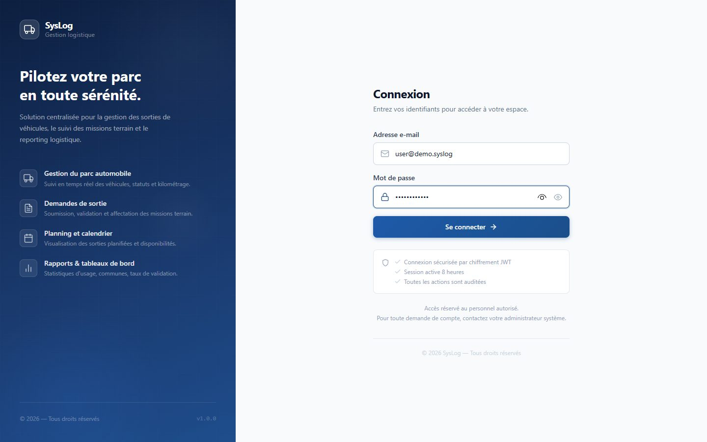

Vous ne pouvez pas créer votre compte vous-même : un administrateur le crée et vous communique votre e-mail de connexion et un **mot de passe provisoire**.

Votre session reste ouverte **8 heures**. Elle est fermée plus tôt si vous vous déconnectez, ou si un administrateur désactive votre compte, modifie votre rôle ou réinitialise votre mot de passe.

## 4. Première connexion et mot de passe

**Première connexion** (ou après une réinitialisation par un administrateur) : SysLog affiche immédiatement cette fenêtre. Aucun écran n'est accessible tant que vous n'avez pas choisi votre propre mot de passe.

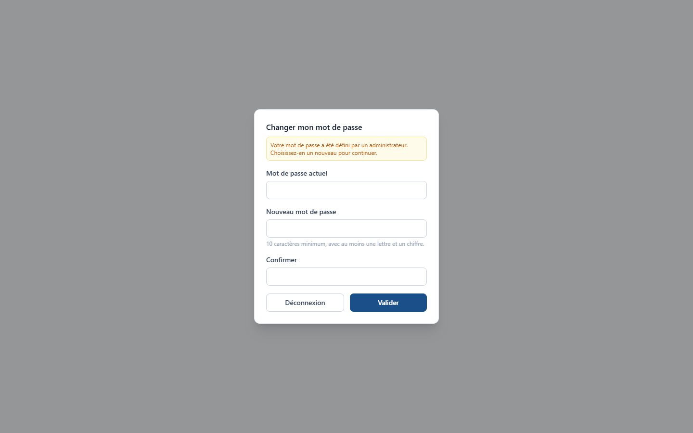

1. **Mot de passe actuel** : le mot de passe provisoire reçu.
2. **Nouveau mot de passe** : **10 caractères minimum**, avec **au moins une lettre et un chiffre**.
3. **Confirmer** : retapez-le, puis **Valider**.

**Changer son mot de passe à tout moment** : en bas du menu, cliquez sur **🔒 Changer mon mot de passe**. Vos autres sessions ouvertes (autre ordinateur, téléphone) sont alors fermées.

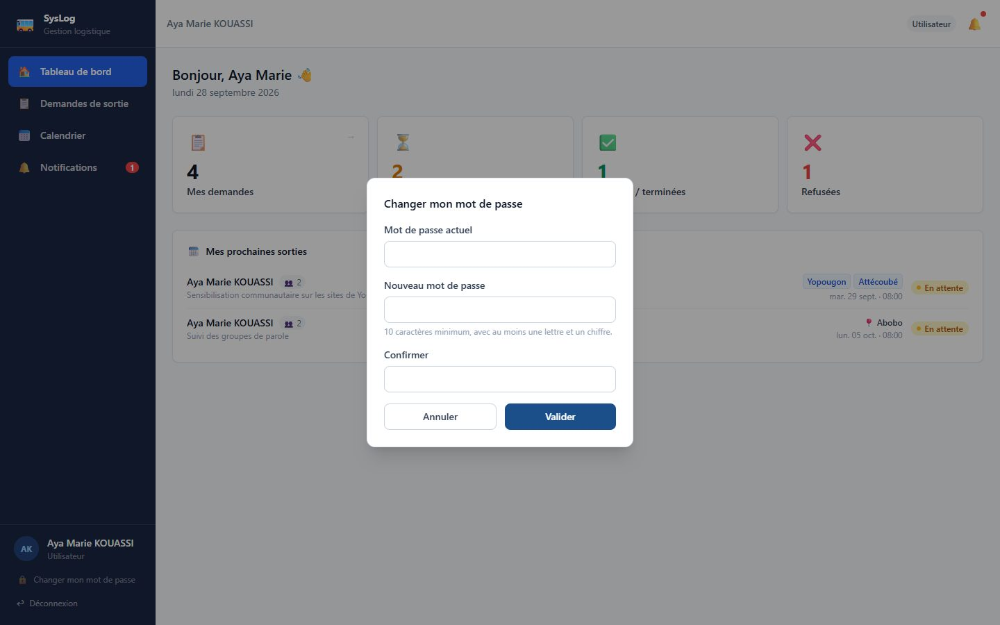

**Mot de passe oublié** : demandez à un administrateur de le réinitialiser ; vous en choisirez un nouveau à la connexion suivante.

## 5. Se repérer dans l'écran

- **À gauche**, le **menu** : il ne montre que les pages autorisées pour votre rôle. En bas : votre nom, votre rôle, **Changer mon mot de passe** et **Déconnexion** (et **Documentation utilisateur** pour les managers et administrateurs).
- **En haut**, votre nom, votre rôle et la **cloche 🔔** des notifications (pastille rouge = notifications non lues).
- **Au centre**, la page en cours. La plupart des listes proposent une vue **grille** (⊞) et une vue **liste** (≡), des filtres et des compteurs.

## 6. Calendrier

Menu **📅 Calendrier** : vue mensuelle des sorties (hors demandes refusées). En haut, le nombre de sorties validées et en attente ; en bas, les totaux du mois.

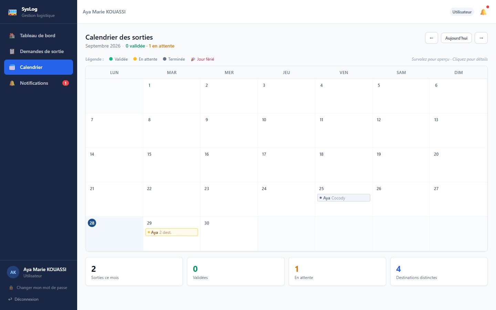

- Naviguez avec **←** / **→**, revenez au mois courant avec **Aujourd'hui**.
- Couleurs : **vert** validée, **orange** en attente, **gris** terminée. « 2 dest. » signale une sortie vers plusieurs communes.
- **Survolez** une sortie pour un aperçu, **cliquez** pour le détail complet.
- Les **jours fériés** apparaissent en rouge (🎉) sous le numéro du jour.

## 7. Notifications

La **cloche 🔔** et le menu **Notifications** listent les messages qui vous concernent, les non lus en premier.

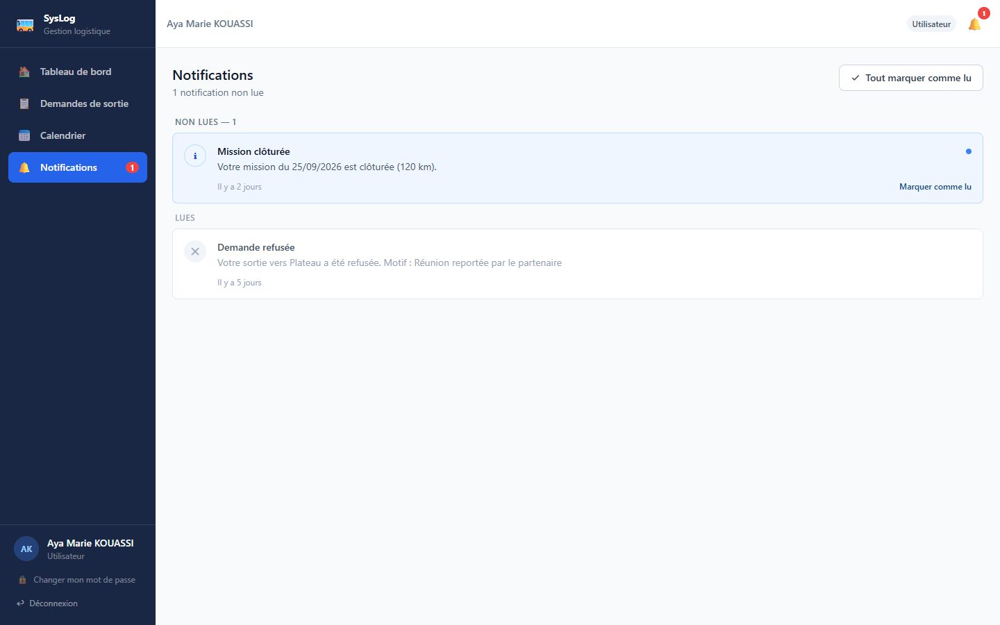

| Événement | Qui est notifié |
|---|---|
| Nouvelle demande de sortie | Managers et administrateurs |
| Demande validée (avec véhicule et chauffeur) | Initiateur et passagers |
| Demande refusée (avec motif) | Initiateur et passagers |
| Mission clôturée (avec distance) | Initiateur et passagers |

Cliquez sur **Marquer comme lu**, ou sur **Tout marquer comme lu**. La liste se met à jour automatiquement toutes les minutes. Si WhatsApp est activé par l'administrateur, les mêmes événements sont aussi envoyés par WhatsApp aux numéros enregistrés.

> Vous ne recevez de notification que si votre compte est rattaché à votre fiche employé (à demander à l'administrateur).

## 8. Se déconnecter

Cliquez sur **↩ Déconnexion** en bas du menu. La session est fermée sur le serveur : même quelqu'un qui aurait récupéré votre session ne peut plus l'utiliser. Déconnectez-vous toujours en fin de journée, surtout sur un poste partagé.

---

# Partie 2 — Utilisateur (agents)

## 9. Mon tableau de bord

La page d'accueil résume **vos demandes** : total, en attente, validées ou terminées, refusées, et vos **prochaines sorties** avec leurs destinations.

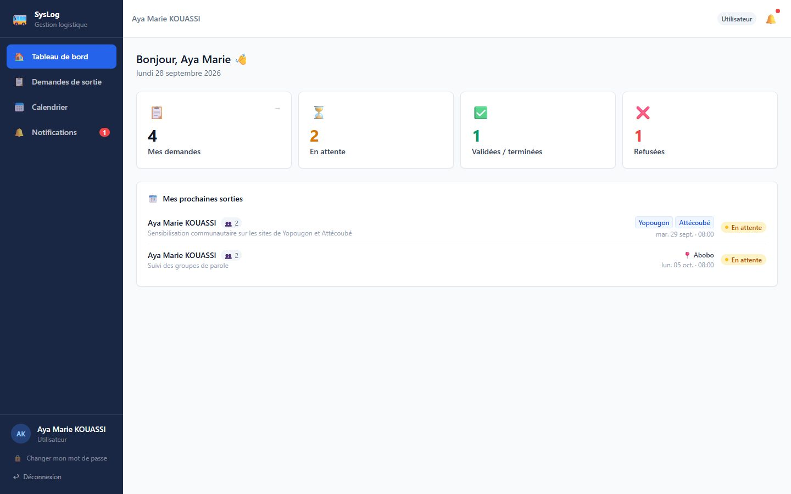

## 10. Créer une demande de sortie

1. Menu **📋 Demandes de sortie** → bouton **+ Nouvelle demande**.
2. Remplissez le formulaire (champs marqués \*) :
   - **Employé initiateur** : c'est toujours vous (champ verrouillé) ;
   - **Passagers / Staff accompagnant** : cliquez, cherchez et cochez les collègues qui partent avec vous (facultatif) ; le **total de personnes** se met à jour ;
   - **Objectif de la mission** \* ;
   - **Communes de destination** \* : cochez **une ou plusieurs** communes — elles forment **une seule** demande ;
   - **Date de déplacement** \* (aujourd'hui ou plus tard) ;
   - **Heure départ** \* et **Heure retour** \* (le retour doit être après le départ).
3. Vérifiez le **récapitulatif** bleu qui apparaît en bas du formulaire.
4. Cliquez sur **✓ Soumettre la demande**.

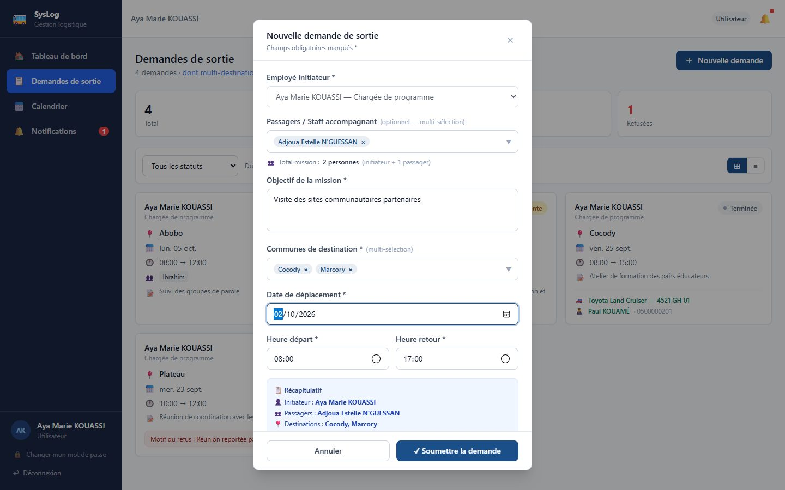

La demande apparaît **En attente** et les managers sont prévenus. Si d'autres personnes vont dans la même commune le même jour, SysLog vous le signale : un regroupement est peut-être possible.

> **Une seule demande par personne et par date.** Si vous avez déjà une demande en attente, validée ou terminée ce jour-là, la nouvelle est refusée avec un message explicite. Pour une tournée, sélectionnez toutes les communes dans **la même** demande.

> Message « Votre compte n'est lié à aucune fiche employé » : un administrateur doit rattacher votre compte à votre fiche.

## 11. Suivre mes demandes

La page **Demandes de sortie** affiche les demandes dont vous êtes l'**initiateur** ou un **passager**.

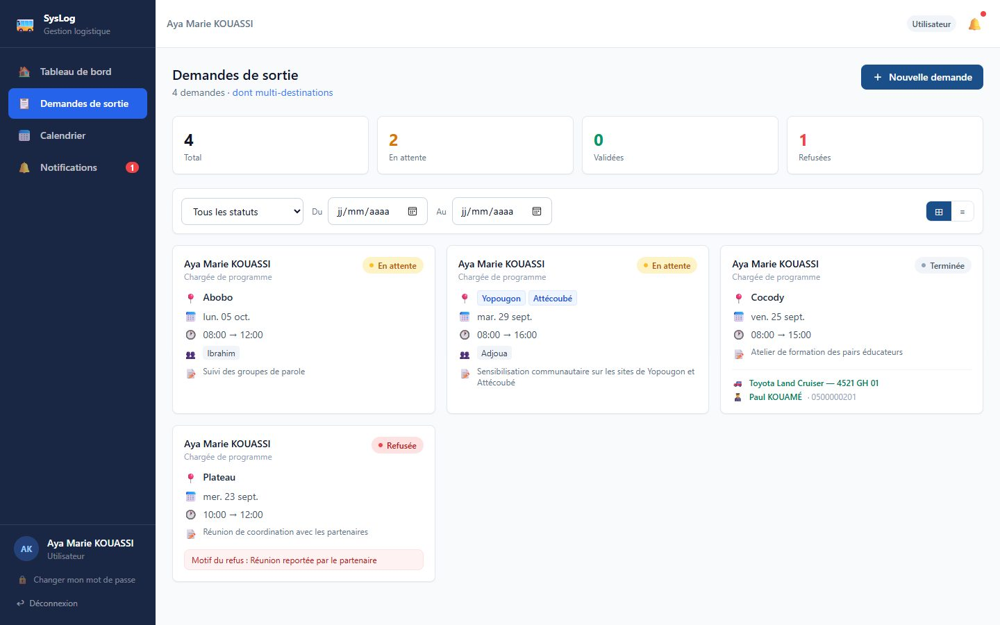

- Compteurs : total, en attente, validées, refusées.
- Filtres : **statut** (dont **Terminées**) et **période** ; **Réinitialiser** efface les filtres.
- Chaque carte indique les destinations, la date, l'horaire, les passagers, l'objectif et, une fois validée, le **véhicule** et le **chauffeur** (avec son téléphone).

| Statut | Signification |
|---|---|
| **En attente** | Pas encore traitée par un responsable |
| **Validée** | Acceptée, véhicule et chauffeur affectés |
| **Refusée** | Refusée ; le **motif du refus** s'affiche sur la carte |
| **Terminée** | Mission effectuée et clôturée |

Pour modifier ou annuler une demande, demandez à un responsable de la refuser (une demande refusée libère la date), puis créez-en une nouvelle.

---

# Partie 3 — Manager (logistique)

Le manager a tous les droits de l'utilisateur. Dans le formulaire de demande, il peut choisir **n'importe quel employé actif** comme initiateur.

## 12. Tableau de bord logistique

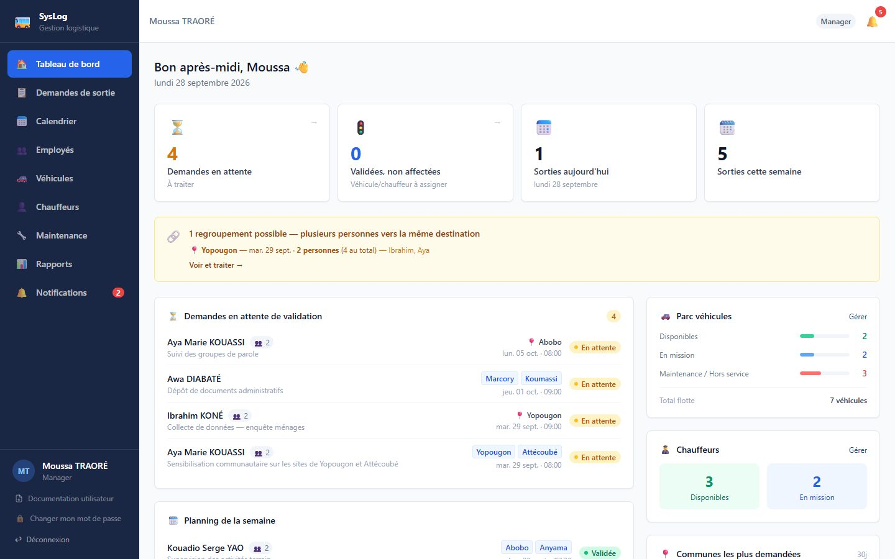

- **Compteurs** : demandes en attente, validées sans véhicule ou chauffeur, sorties du jour et de la semaine.
- **Regroupements possibles** (encadré jaune) : plusieurs personnes vont dans la même commune le même jour — l'occasion de partager un véhicule. **Voir et traiter →** ouvre les demandes concernées.
- **Demandes en attente de validation**, **planning de la semaine**, état du **parc véhicules** et des **chauffeurs**, **communes les plus demandées**.

## 13. Traiter les demandes : valider

La page **Demandes de sortie** montre toutes les demandes, avec l'alerte de regroupement en haut.

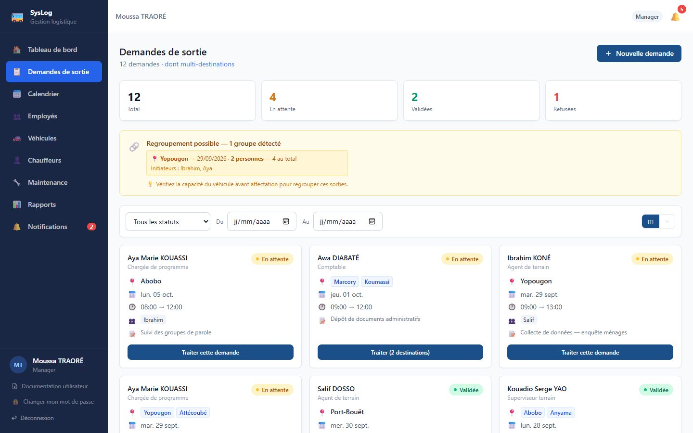

1. Sur une demande **En attente**, cliquez sur **Traiter cette demande** (ou **Traiter (N destinations)**).
2. Relisez le résumé : initiateur, passagers, destinations, nombre de personnes, date, horaire, objectif.
3. Choisissez un **véhicule** : seuls les véhicules **disponibles** sont proposés ; SysLog indique si la capacité suffit (« ✓ Capacité OK »).
4. Choisissez un **chauffeur** disponible.
5. Cliquez sur **✓ Valider**.

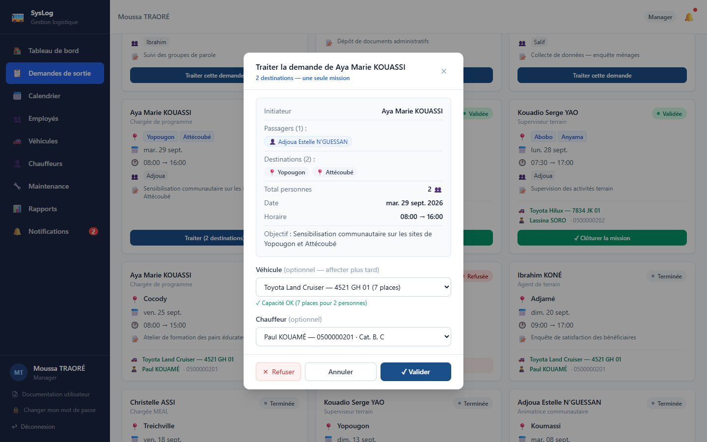

Le véhicule et le chauffeur passent **En mission** et ne sont plus proposés jusqu'à la clôture. L'initiateur et les passagers sont notifiés ; le chauffeur reçoit un message WhatsApp si le service est activé.

SysLog **refuse la validation** si :

- le véhicule ou le chauffeur vient d'être affecté par un autre responsable ;
- le nombre de personnes dépasse la capacité du véhicule ;
- le **permis du chauffeur sera expiré** à la date de la mission.

> Vous pouvez valider sans véhicule ni chauffeur et les affecter autrement ; ils n'apparaîtront pas sur la demande.

## 14. Refuser une demande

1. **Traiter cette demande** → bouton rouge **Refuser**.
2. Saisissez le **Motif du refus** \* (obligatoire ; il est conservé et affiché sur la demande).
3. Cliquez sur **Refuser**.

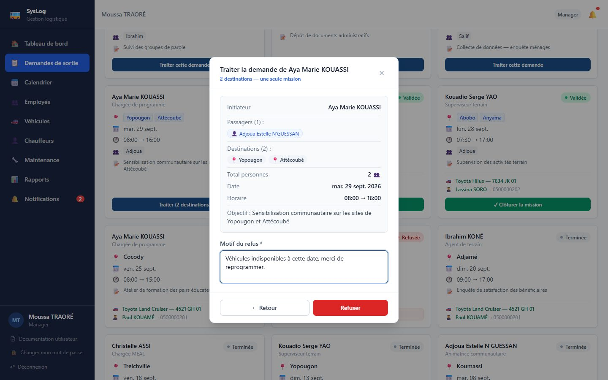

Une demande **en attente** ou **validée** peut être refusée ; si elle était validée, le véhicule et le chauffeur redeviennent disponibles. Une mission **terminée** ne peut plus être refusée.

## 15. Clôturer une mission

Au retour du véhicule :

1. Sur une demande **Validée**, cliquez sur **✓ Clôturer la mission**.
2. Saisissez le **Km départ** et le **Km retour** relevés au compteur : la **distance parcourue** s'affiche.
3. Cliquez sur **✓ Clôturer la mission**.

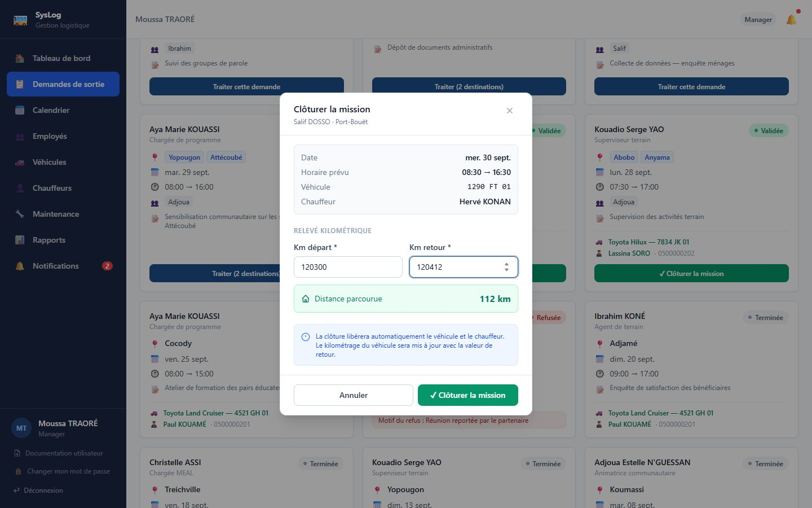

La demande passe **Terminée**, le **compteur du véhicule** est mis à jour, le véhicule et le chauffeur redeviennent **disponibles**. SysLog refuse un kilométrage de retour inférieur au départ ou au compteur actuel du véhicule.

## 16. Véhicules

Menu **🚗 Véhicules** : compteurs par statut, filtres, vue grille ou liste.

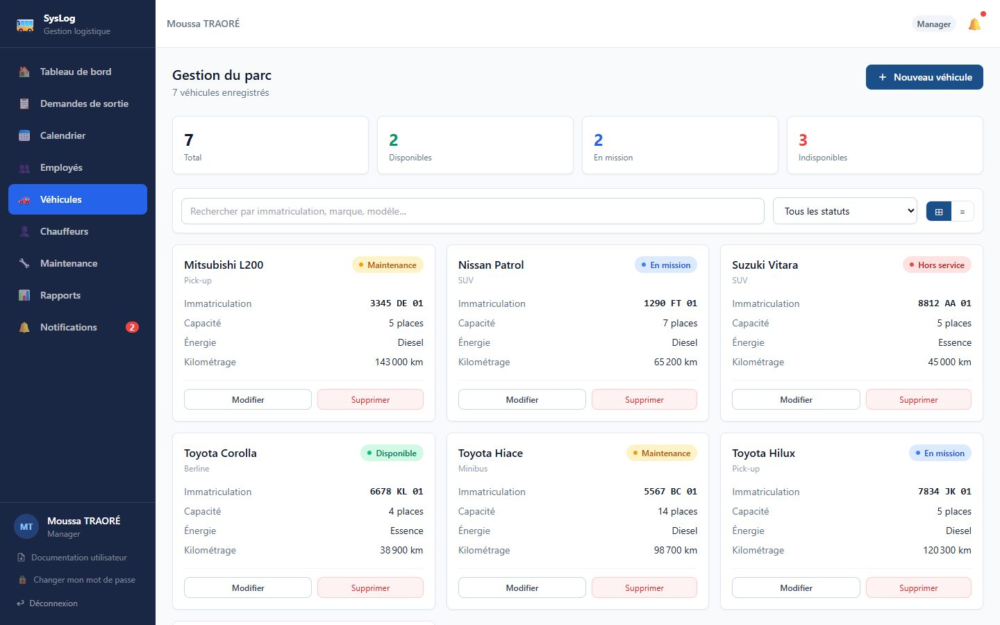

- **+ Nouveau véhicule** : immatriculation\*, marque\*, modèle\*, type\*, capacité\* (places), kilométrage, année de mise en service, énergie.
- **Modifier** : toutes les informations, dont le **statut** (disponible, en mission, maintenance, hors service).
- **Supprimer** (administrateur) : impossible pour un véhicule qui a un historique ; passez-le plutôt **hors service**.

## 17. Chauffeurs

Menu **👤 Chauffeurs** :

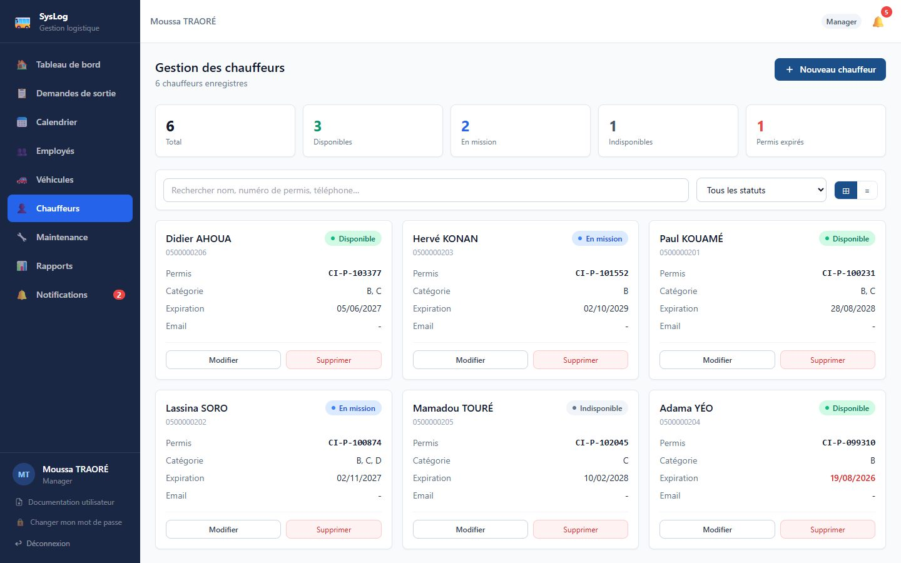

- **+ Nouveau chauffeur** : nom\*, prénoms\*, numéro de permis\*, catégorie\*, date d'expiration du permis\*, téléphone, e-mail.
- Statut : disponible, en mission, indisponible.
- Le compteur **Permis expirés** et la date **en rouge** signalent les permis à renouveler : un chauffeur au permis expiré à la date d'une mission ne peut pas y être affecté.
- **Supprimer** (administrateur) : impossible pour un chauffeur qui a déjà effectué des missions ; passez-le **indisponible**.

## 18. Maintenance

Menu **🔧 Maintenance** : dossiers en cours, planifiés et terminés.

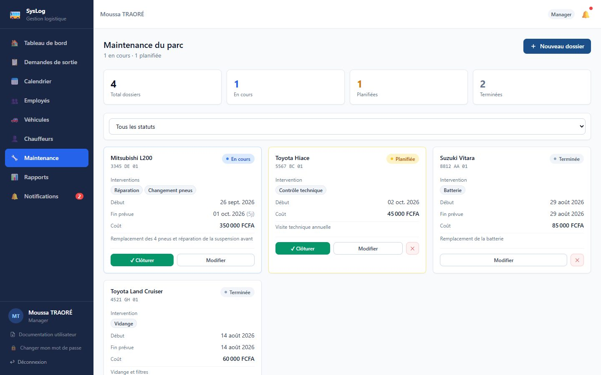

1. **+ Nouveau dossier de maintenance** : véhicule\*, type(s) d'intervention, date de début\*, date de fin prévue, coût estimé (FCFA), description, statut **planifiée** ou **en cours**. Le véhicule passe **en maintenance**. Un véhicule **en mission** ne peut pas être sélectionné : clôturez d'abord la mission.
2. **Clôturer la maintenance** : coût final, notes, puis l'état du véhicule après intervention : **Disponible** ou **Hors service**.
3. Un dossier **en cours** ne peut pas être supprimé. Supprimer un dossier planifié remet le véhicule disponible s'il n'a pas d'autre dossier ouvert.

## 19. Employés (consultation)

Menu **👥 Employés** : fiches du personnel (poste, projet, service, contrat, téléphone, statut…). Le manager **consulte** ; seuls les administrateurs créent, modifient ou suppriment (voir 21).

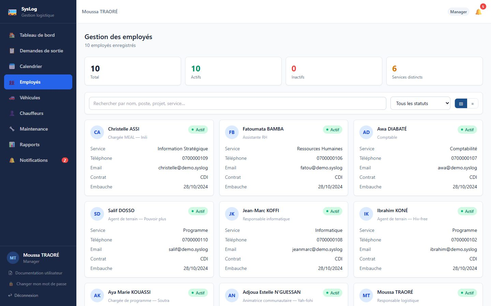

Ces fiches contiennent des **données personnelles** : ne les communiquez pas en dehors du besoin professionnel.

## 20. Rapports

Menu **📊 Rapports** :

1. Choisissez la **période** : Aujourd'hui, Cette semaine, Ce mois ou Personnalisée.
2. Cliquez sur **Export XLSX** sous le rapport voulu : un fichier **Excel** est téléchargé. Le nombre de lignes exportées est indiqué à côté.

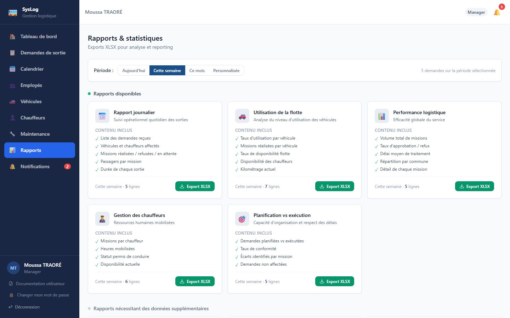

| Rapport | Contenu |
|---|---|
| Rapport journalier | Détail des sorties : date, initiateur, communes, horaires, durée, objectif, statut, véhicule, chauffeur, passagers |
| Utilisation de la flotte | Missions et taux d'utilisation par véhicule |
| Performance logistique | Volume, taux d'approbation, motifs de refus, répartition par commune |
| Gestion des chauffeurs | Missions, heures, permis, disponibilité |
| Planification vs exécution | Missions prévues comparées aux missions clôturées |

Les rapports de la section « nécessitant des données supplémentaires » (carburant, incidents…) ne sont pas encore disponibles.

---

# Partie 4 — Administrateur

L'administrateur a tous les droits du manager, et peut **créer, modifier et supprimer les fiches employés** (menu **👥 Employés**, boutons **Nouvel employé**, **Modifier**, **Supprimer**). Un employé qui figure dans des demandes ne peut pas être supprimé : passez-le **inactif**. Saisissez le **téléphone** au format ivoirien à 10 chiffres (ex. 07 00 00 00 00) : il sert aux messages WhatsApp.

## 21. Comptes et rôles

Menu **🔐 Accès & Rôles** : liste des comptes avec rôle, poste, statut et dernier accès. Un bandeau signale les employés qui n'ont pas encore de compte.

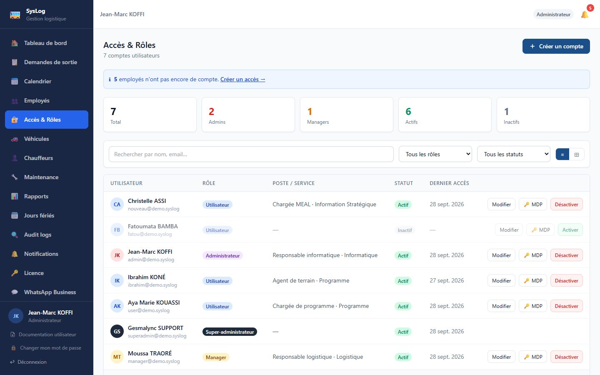

**Créer un compte** (bouton **+ Créer un compte**) :

1. **Employé lié** : choisissez l'employé ; prénom, nom et e-mail sont repris de sa fiche. *Indispensable* pour qu'un utilisateur voie ses demandes, en crée et reçoive les notifications.
2. **Rôle** : Utilisateur, Manager ou Administrateur (la description du rôle s'affiche dessous).
3. **Mot de passe** provisoire : 10 caractères minimum, avec une lettre et un chiffre. L'utilisateur devra le changer à sa première connexion.
4. **Créer le compte**, puis communiquez l'e-mail et le mot de passe provisoire à la personne, de vive voix de préférence.

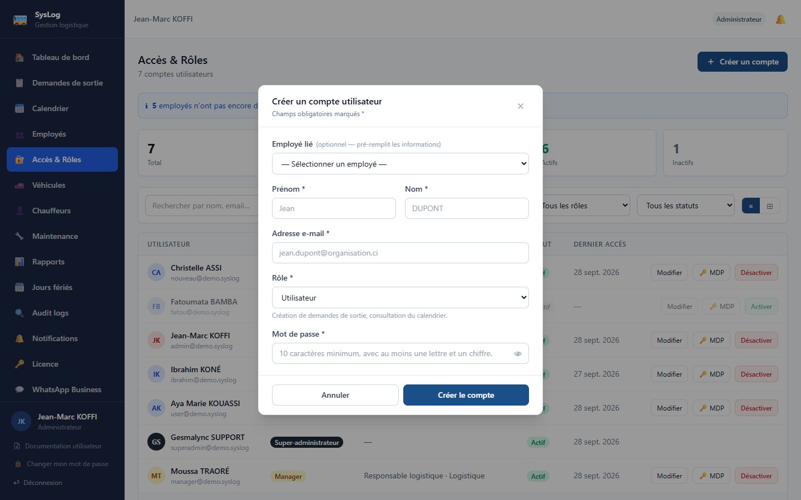

Sur chaque compte :

- **Modifier** : nom, e-mail, employé lié, rôle, statut. Un changement de rôle déconnecte la personne.
- **🔑 MDP** : réinitialiser le mot de passe ; la personne est déconnectée et devra en choisir un nouveau.
- **Désactiver / Activer** : un compte désactivé est déconnecté immédiatement.

Protections : vous ne pouvez ni désactiver votre propre compte ni retirer vos propres droits d'administrateur ; il reste toujours au moins un administrateur actif. Les comptes **super-administrateur** ne peuvent être modifiés que par un super-administrateur (aucun bouton n'apparaît pour eux).

## 22. Jours fériés

Menu **🗓️ Jours fériés** :

1. Saisissez le **libellé** et la **date**.
2. Cochez **Chaque année** pour une fête à date fixe.
3. Cliquez sur **+ Ajouter**.

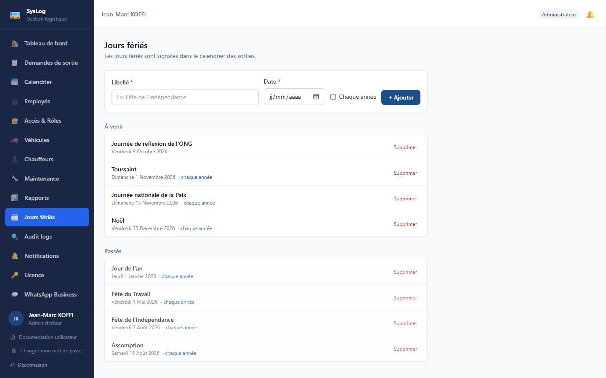

La liste distingue les jours **à venir** et **passés** ; **Supprimer** retire un jour après confirmation. Les jours fériés s'affichent dans le calendrier de tous les utilisateurs.

## 23. Journal d'audit

Menu **🔍 Audit logs** : historique des actions sensibles (création, modification, validation, refus, clôture, suppression, comptes, mots de passe, licence, jours fériés…) avec l'auteur, la date, l'adresse IP et le détail. Filtrez par utilisateur, type d'élément, action et période.

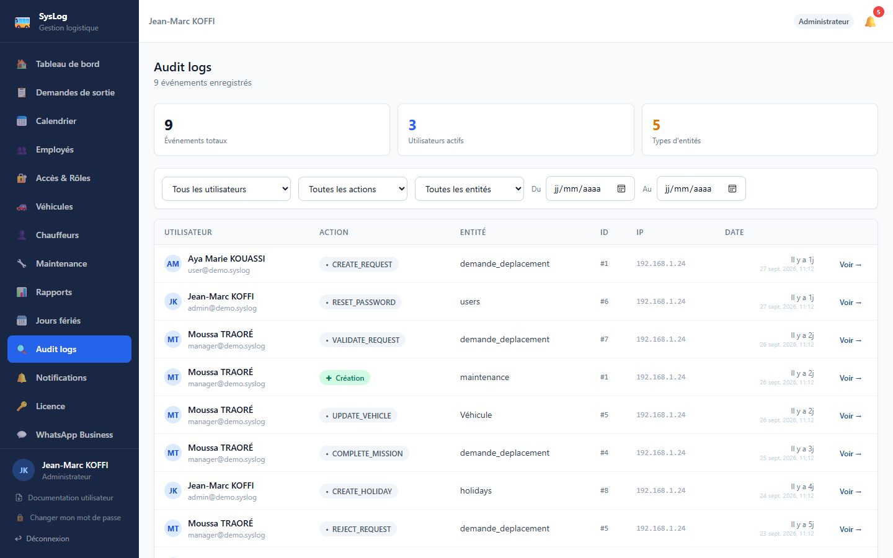

Les mots de passe, clés de licence et numéros de sécurité sociale sont **masqués** dans le détail. Si un compte est supprimé, son historique est conservé.

## 24. Licence

Menu **🔑 Licence** :

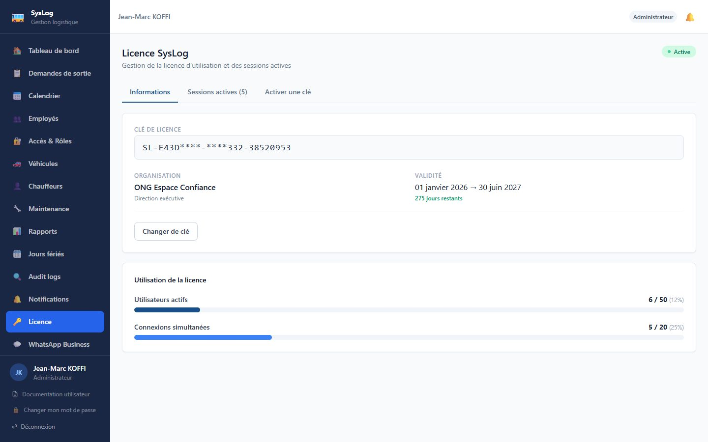

- **Informations** : clé (masquée), organisation, validité et jours restants, utilisateurs actifs et **personnes connectées** par rapport aux limites de la licence.
- **Sessions actives** : qui est connecté et depuis quelle adresse ; **Déconnecter** ferme immédiatement la session.
- **Activer une clé** : collez la clé reçue de l'éditeur (format `SL-XXXXXXXX-XXXXXXXX-XXXXXXXX`) puis **✓ Activer la licence** ; elle remplace la licence active.

Un **bandeau** prévient les administrateurs 30 jours avant l'expiration. Sans licence valide, les utilisateurs ne peuvent plus travailler ; les administrateurs peuvent toujours se connecter et activer une nouvelle clé. Les administrateurs ne sont jamais bloqués par la limite de connexions.

## 25. WhatsApp

Menu **💬 WhatsApp Business** :

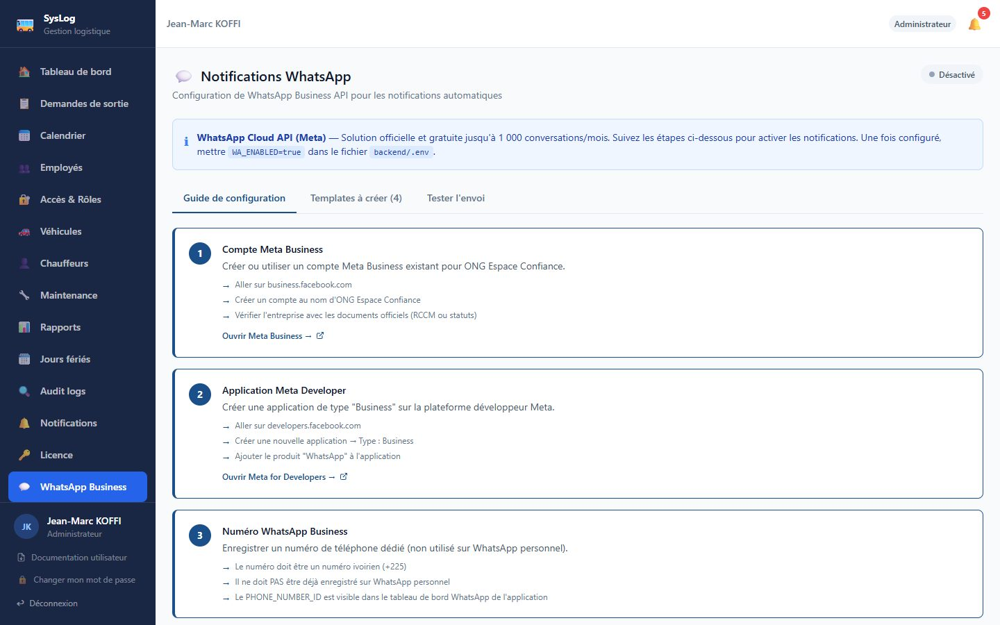

- le badge en haut à droite indique si le service est **Activé** ou **Désactivé** ;
- **Guide de configuration** : étapes pour le compte Meta Business, le numéro et le jeton — à réaliser avec l'équipe technique, qui renseigne la configuration du serveur ;
- **Templates à créer** : les quatre modèles de messages à faire approuver par Meta ;
- **Tester l'envoi** : numéro ivoirien à 10 chiffres et message libre (délivré seulement si la personne a écrit au numéro de l'organisation dans les 24 dernières heures, règle Meta).

---

# Partie 5 — Super-administrateur

Le super-administrateur est réservé à l'**éditeur** de SysLog. Il a tous les droits d'un administrateur, plus les actions ci-dessous.

## 26. Émettre et gérer les licences

Menu **🔑 Licence** → onglet **✦ Générer une licence** (visible uniquement pour le super-administrateur) :

1. **Organisation** \*, **Contact**, **Date d'expiration** \*.
2. **Max utilisateurs** et **Max connexions simultanées**.
3. **Notes internes** (facultatif), puis **✦ Générer la licence**.

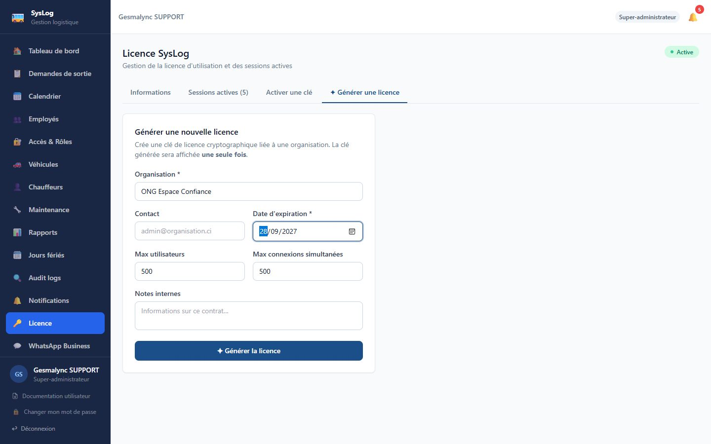

La clé complète n'est affichée **qu'une seule fois** : copiez-la et transmettez-la de façon sûre. Si une licence est déjà active, la nouvelle est créée **suspendue** et s'active avec **Activer une clé**. Dans l'onglet **Informations**, le super-administrateur peut aussi **Suspendre** ou **Réactiver** la licence.

## 27. Comptes super-administrateur

Dans **🔐 Accès & Rôles**, seul un super-administrateur peut attribuer le rôle **Super-administrateur**, et modifier, désactiver ou réinitialiser un compte de ce rôle. Il doit toujours rester au moins un super-administrateur actif.

---

# Partie 6 — Références

## 28. Utiliser SysLog sur téléphone

L'affichage s'adapte aux petits écrans. Le menu est replié : touchez **☰** en haut à gauche pour l'ouvrir, puis choisissez une page.

| Page Demandes | Menu ouvert |
|---|---|
| 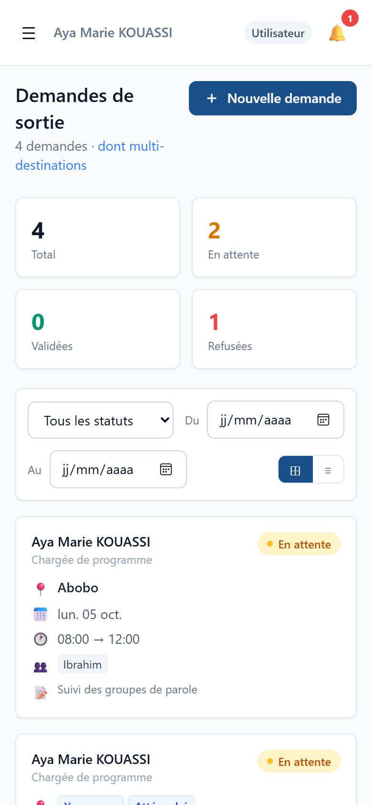 | 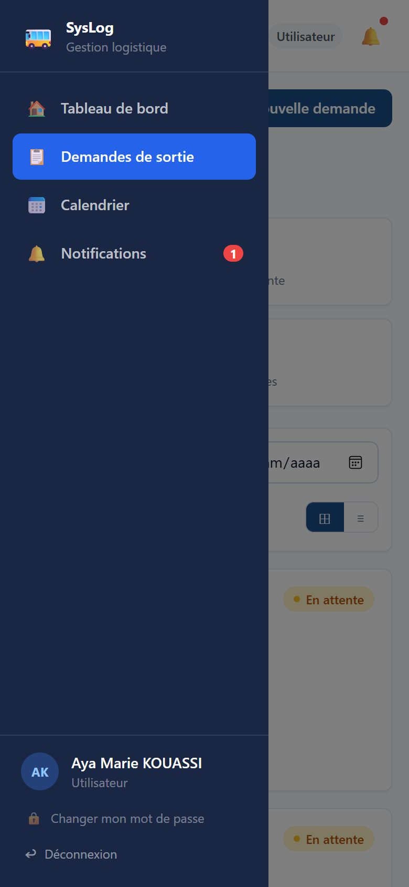 |

## 29. Messages d'erreur et solutions

| Message | Explication | Que faire |
|---|---|---|
| « Email ou mot de passe incorrect. » | Identifiants erronés, ou compte désactivé | Vérifiez la saisie ; sinon contactez l'administrateur |
| « Trop de tentatives de connexion. » | Trop d'essais pour ce compte depuis ce poste | Attendez 15 minutes |
| « Nombre maximum d'utilisateurs connectés simultanément atteint » | Limite de la licence atteinte | Réessayez plus tard ou prévenez l'administrateur |
| « Système non licencié » / « Licence expirée » / « Licence suspendue » | La licence n'est pas valide | Prévenez l'administrateur |
| Retour soudain à la page de connexion | Session expirée (8 h), déconnexion ailleurs, compte modifié par un administrateur | Reconnectez-vous |
| « Un employé ne peut pas avoir plusieurs demandes pour la même date » | Une demande existe déjà ce jour-là pour cet initiateur | Regroupez les destinations dans une seule demande |
| « Véhicule non disponible » / « Chauffeur non disponible » | Affecté entre-temps ou en maintenance | Rafraîchissez la page et choisissez-en un autre |
| « Capacité insuffisante » | Trop de personnes pour ce véhicule | Choisissez un véhicule plus grand |
| « Le permis de ce chauffeur sera expiré… » | Permis échu à la date de la mission | Choisissez un autre chauffeur ou mettez à jour sa fiche |
| « Opération impossible : cet élément est utilisé ailleurs » | Suppression d'un élément lié à l'historique | Désactivez-le plutôt (inactif, hors service, indisponible) |
| « Accès refusé. » | Votre rôle ne permet pas cette action | Adressez-vous à un manager ou un administrateur |
| « Données invalides » | Un champ est mal rempli | Corrigez le champ indiqué |

## 30. Questions fréquentes

**Je ne vois pas mes demandes / je ne peux pas en créer.**
Votre compte doit être rattaché à votre fiche employé : demandez-le à un administrateur.

**Puis-je modifier ou annuler une demande envoyée ?**
Demandez à un responsable de la refuser (motif « à corriger » ou « annulée »), puis créez-en une nouvelle si besoin.

**Pourquoi un véhicule n'apparaît-il pas lors de la validation ?**
Il n'est pas « Disponible » (en mission, en maintenance ou hors service).

**Le kilométrage d'un véhicule est faux.**
Un manager peut le corriger en modifiant le véhicule.

**Un collègue a quitté l'organisation.**
L'administrateur passe sa fiche en **inactif** et **désactive** son compte, sans les supprimer, pour conserver l'historique.

**Je n'ai pas reçu de message WhatsApp.**
Le service est peut-être désactivé ou le numéro de votre fiche est incomplet ; les notifications dans l'application restent disponibles.

## 31. Bonnes pratiques

- Déconnectez-vous en fin de journée, surtout sur un poste partagé.
- Ne communiquez jamais votre mot de passe ; choisissez-en un long et propre à SysLog.
- Créez vos demandes **à l'avance** et regroupez les communes d'une même tournée dans **une seule** demande.
- Managers : consultez les **regroupements possibles** avant de valider ; clôturez les missions **dès le retour** avec le kilométrage réel.
- Tenez à jour les **dates d'expiration des permis** et les **téléphones**.
- Administrateurs : rattachez chaque compte à sa fiche employé et désactivez sans délai les comptes des personnes parties.

## 32. Glossaire

| Terme | Définition |
|---|---|
| **Affectation** | Attribution d'un véhicule et d'un chauffeur à une demande validée |
| **Audit** | Journal automatique des actions effectuées dans le système |
| **Clôture de mission** | Étape finale d'une sortie, avec saisie du kilométrage |
| **Commune** | Destination géographique d'une sortie |
| **Demande de sortie** | Requête d'utilisation d'un véhicule, vers une ou plusieurs communes |
| **Employé** | Membre du personnel enregistré dans SysLog (fiche employé) |
| **Hors service** | Véhicule immobilisé durablement |
| **Initiateur** | Employé à l'origine d'une demande |
| **Licence** | Droit d'utilisation de SysLog, limitant le nombre d'utilisateurs et de connexions |
| **Passager** | Employé accompagnant l'initiateur |
| **Regroupement** | Suggestion de mutualiser des sorties vers la même destination le même jour |
| **Rôle** | Niveau d'accès : Utilisateur, Manager, Administrateur, Super-administrateur |
| **Session** | Période de connexion active (8 heures au plus) |
| **Statut** | État d'une demande, d'un véhicule, d'un chauffeur ou d'une maintenance |

## 33. Support

**Référent interne** : l'administrateur SysLog désigné par la direction d'Espace Confiance est le premier contact pour les comptes, les mots de passe et les questions d'utilisation.

**Signaler une anomalie** :

1. notez ce que vous faisiez, ce qui s'est passé et le message affiché ;
2. faites une capture d'écran si possible ;
3. transmettez-le à l'administrateur SysLog, qui le fera suivre au développeur si nécessaire.

**Développeur** : Gesmalync — Serges Alain GNAZERE (IT | Senior MEAL Officer | DBA).

---

*Gesmalync © 2026 — Développé pour ONG Espace Confiance*
